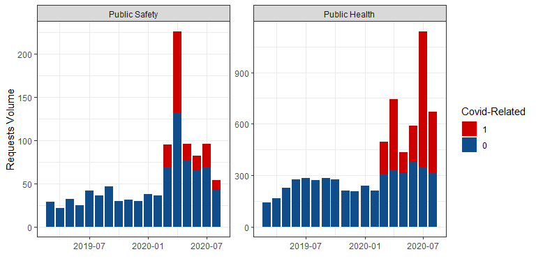
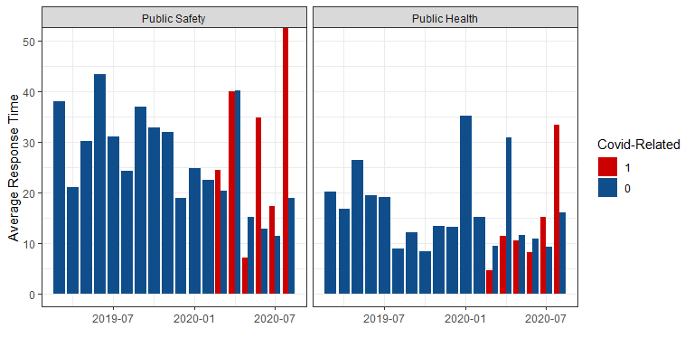
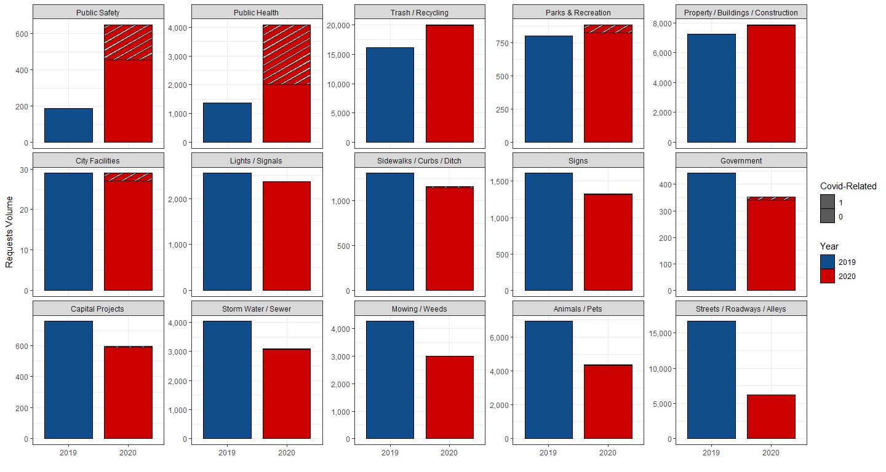
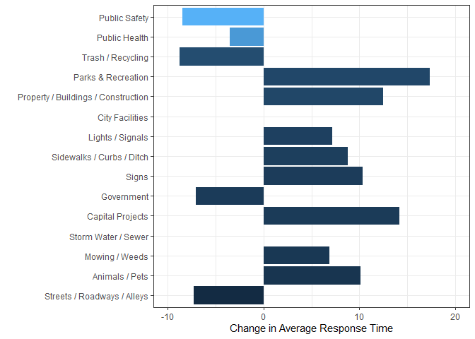
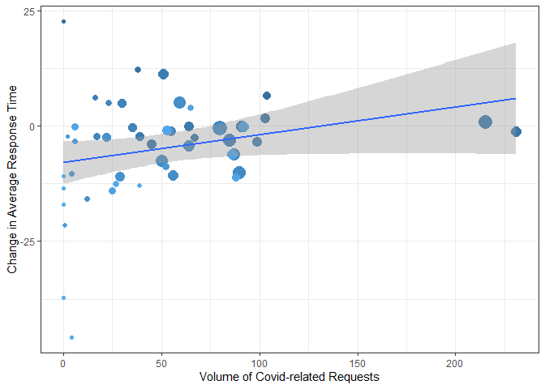
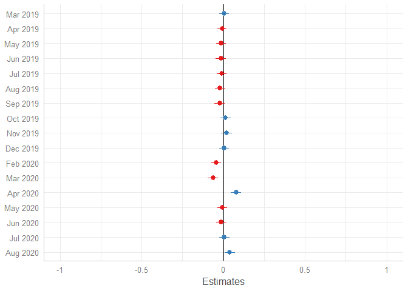

Did COVID-19 Induce A Strenuous Effect on the 311 Non-Emergency Services
System?
================

**Abstract**

In this paper we examine whether COVID-19 imposed a crowd out effect on
the 311 non-emergency services using data from Kansas City, Missouri
during the early stage of the pandemic. Using description text data, we
identify covid-related requests and use them as a proxy for the strains
put on the 311 systems by the health crisis. We find robust evidence
through our difference in difference approach that zip code with an
additional covid-related request would experience half an hour delay the
response time for non-covid related requests. In addition, the strains
on the 311 system mainly affected three categories: “Mowing / Weeds”,
“Trash / Recycling”, and “Animals & Pets”.

Keywords: crisis response, 311, crowd out effect, COVID-19, text mining

supporting dataset

## Summary statistics

    ##       obs min q25      mean q75 max                                 var
    ## 1  172722   0   2 32.609685  31 532                                 all
    ## 2  170215   0   2 32.807655  31 532                                   0
    ## 3    2507   0   1 19.168329   6 180                                   1
    ## 4   96161   0   2 32.860286  36 532                                2019
    ## 5   76561   0   1 32.294928  24 238                                2020
    ## 6   16263   0   1  8.717641   4 368                      Animals / Pets
    ## 7    1818   0   9 52.468647  71 210                    Capital Projects
    ## 8      84   0   1 70.928571 180 216                     City Facilities
    ## 9    1193   0   1 14.334451   9 320                          Government
    ## 10   7590   0   2  8.551252   5 243                    Lights / Signals
    ## 11   8986   0   9 82.613621 180 483                      Mowing / Weeds
    ## 12   2156   0   3 30.823748  35 211                  Parks & Recreation
    ## 13  22361   0   8 70.235007 144 532 Property / Buildings / Construction
    ## 14   6881   0   1 15.950879  12 269                       Public Health
    ## 15   1047   0   5 27.830946  29 180                       Public Safety
    ## 16   3239   0   1 16.947823  14 273           Sidewalks / Curbs / Ditch
    ## 17   4368   0   4 18.459478  14 400                               Signs
    ## 18   9351   0   4 35.345097  49 427                 Storm Water / Sewer
    ## 19  33053   0   7 35.586543  50 432         Streets / Roadways / Alleys
    ## 20  54332   0   1 21.106549   8 532                   Trash / Recycling

Despite the influx of covid-related calls, response time for public
health and public safety are actually lower than the previous year

<!-- -->

<!-- -->

<!-- -->

<!-- -->

## Method

### Geographical variation

<!-- -->

<!-- -->

    ## 
    ## Call:
    ## lm(formula = daytoclose_diff ~ n_allcovid, data = dat %>% filter(CREATEMO %in% 
    ##     3:8) %>% group_by(CREATEYR, ZIP) %>% summarize(daytoclose = mean(DAYTOCLOSE, 
    ##     na.rm = T)) %>% dcast(ZIP ~ CREATEYR) %>% mutate(daytoclose_diff = `2020` - 
    ##     `2019`) %>% rename(daytoclose_2020 = `2020`, daytoclose_2019 = `2019`) %>% 
    ##     left_join(zip_covid_311))
    ## 
    ## Residuals:
    ##     Min      1Q  Median      3Q     Max 
    ## -38.026  -5.469   1.246   4.698  30.599 
    ## 
    ## Coefficients:
    ##             Estimate Std. Error t value Pr(>|t|)   
    ## (Intercept) -7.95645    2.26984  -3.505  0.00101 **
    ## n_allcovid   0.06054    0.03231   1.874  0.06720 . 
    ## ---
    ## Signif. codes:  0 '***' 0.001 '**' 0.01 '*' 0.05 '.' 0.1 ' ' 1
    ## 
    ## Residual standard error: 10.89 on 47 degrees of freedom
    ##   (2 observations deleted due to missingness)
    ## Multiple R-squared:  0.0695, Adjusted R-squared:  0.04971 
    ## F-statistic: 3.511 on 1 and 47 DF,  p-value: 0.0672

## Difference in difference

### Regression results

### Main results

    ## 
    ## =============================================================================================
    ##                             (1)             (2)              (3)              (4)            
    ## ---------------------------------------------------------------------------------------------
    ## DiD effect                       0.0186 **       0.0198 ***       0.0192 ***       0.0200 ***
    ##                                 (0.0058)        (0.0058)         (0.0058)         (0.0058)   
    ## 911 Vol Fire Department                          0.0040 ***                        0.0030 ***
    ##                                                 (0.0002)                          (0.0002)   
    ## 911 Vol Police Department                       -0.0006 ***                       -0.0003 ***
    ##                                                 (0.0000)                          (0.0000)   
    ## Local Government Employees                                        1.3769 ***       0.9853 ***
    ##                                                                  (0.0817)         (0.0948)   
    ## ---------------------------------------------------------------------------------------------
    ## Num. obs.                   170214          170214           170214           170214         
    ## Num. groups: n_allcovid         41              41               41               41         
    ## Num. groups: after               2               2                2                2         
    ## =============================================================================================
    ## *** p < 0.001; ** p < 0.01; * p < 0.05

### By Categories

    ## 
    ## ===========================================================================================================
    ##                             Animals / Pets  Capital Projects  City Facilities  Government  Lights / Signals
    ## -----------------------------------------------------------------------------------------------------------
    ## DiD effect                      0.0371 **      0.0337          0.1076             0.0589     -0.0188       
    ##                                (0.0117)       (0.0383)        (0.6713)           (0.0553)    (0.0116)      
    ## 911 Vol Fire Department         1.0010 ***     1.9314 **      -4.3699             0.8018      0.1685       
    ##                                (0.1567)       (0.7472)        (5.7445)           (0.6738)    (0.2106)      
    ## 911 Vol Police Department       0.0015 ***     0.0182 ***      0.0171             0.0011      0.0016 ***   
    ##                                (0.0003)       (0.0016)        (0.0128)           (0.0015)    (0.0004)      
    ## Local Government Employees     -0.0005 ***    -0.0027 ***     -0.0030            -0.0006     -0.0005 ***   
    ##                                (0.0001)       (0.0004)        (0.0029)           (0.0003)    (0.0001)      
    ## -----------------------------------------------------------------------------------------------------------
    ## Num. obs.                   16252           1812              82               1182        7586            
    ## Num. groups: n_allcovid        41             41              18                 41          41            
    ## Num. groups: after              2              2               2                  2           2            
    ## ===========================================================================================================
    ## *** p < 0.001; ** p < 0.01; * p < 0.05

    ## 
    ## =================================================================================================================================
    ##                             Mowing / Weeds  Parks & Recreation  Property / Buildings / Construction  Public Health  Public Safety
    ## ---------------------------------------------------------------------------------------------------------------------------------
    ## DiD effect                     0.1056 *       -0.0365               0.0125                              0.0009       -0.0324     
    ##                               (0.0423)        (0.0427)             (0.0250)                            (0.0174)      (0.0537)    
    ## 911 Vol Fire Department        4.5563 ***      1.1339               2.5308 ***                         -0.8397 **     1.1520     
    ##                               (0.7009)        (0.6402)             (0.3367)                            (0.3056)      (0.8129)    
    ## 911 Vol Police Department      0.0044 **       0.0087 ***           0.0088 ***                          0.0021 **    -0.0053 **  
    ##                               (0.0014)        (0.0014)             (0.0008)                            (0.0007)      (0.0019)    
    ## Local Government Employees    -0.0009 **      -0.0017 ***          -0.0019 ***                         -0.0010 ***    0.0006     
    ##                               (0.0003)        (0.0003)             (0.0002)                            (0.0002)      (0.0005)    
    ## ---------------------------------------------------------------------------------------------------------------------------------
    ## Num. obs.                   8969            2097                22334                                4804           853          
    ## Num. groups: n_allcovid       41              36                   41                                  41            39          
    ## Num. groups: after             2               2                    2                                   2             2          
    ## =================================================================================================================================
    ## *** p < 0.001; ** p < 0.01; * p < 0.05

    ## 
    ## =========================================================================================================================================
    ##                             Sidewalks / Curbs / Ditch  Signs          Storm Water / Sewer  Streets / Roadways / Alleys  Trash / Recycling
    ## -----------------------------------------------------------------------------------------------------------------------------------------
    ## DiD effect                     0.0072                    -0.0071        -0.0012               -0.0232 *                     0.0622 ***   
    ##                               (0.0263)                   (0.0203)       (0.0185)              (0.0097)                     (0.0090)      
    ## 911 Vol Fire Department        1.1116 **                  1.6073 ***    -0.8295 *              0.6857 ***                   0.2235       
    ##                               (0.4111)                   (0.3772)       (0.3249)              (0.1772)                     (0.1473)      
    ## 911 Vol Police Department      0.0041 ***                 0.0029 ***     0.0015 *              0.0040 ***                   0.0013 ***   
    ##                               (0.0009)                   (0.0008)       (0.0007)              (0.0003)                     (0.0003)      
    ## Local Government Employees    -0.0008 ***                -0.0004 *       0.0002               -0.0004 ***                  -0.0005 ***   
    ##                               (0.0002)                   (0.0002)       (0.0002)              (0.0001)                     (0.0001)      
    ## -----------------------------------------------------------------------------------------------------------------------------------------
    ## Num. obs.                   3231                       4362           9337                 33034                        54279            
    ## Num. groups: n_allcovid       40                         41             41                    41                           41            
    ## Num. groups: after             2                          2              2                     2                            2            
    ## =========================================================================================================================================
    ## *** p < 0.001; ** p < 0.01; * p < 0.05

## Robustness Check

### Fixed Effects

    ## 
    ## ====================================================================================================
    ##                             OLS             FE period-zipcode  FE date-zipcode  FE date-neighborhood
    ## ----------------------------------------------------------------------------------------------------
    ## DiD effect                       0.0159 **       0.0186 **          0.0166 **        0.0190 ***     
    ##                                 (0.0058)        (0.0058)           (0.0057)         (0.0056)        
    ## ----------------------------------------------------------------------------------------------------
    ## Num. obs.                   170214          170214             170214           170214              
    ## Num. groups: n_allcovid                         41                 41                               
    ## Num. groups: after                               2                                                  
    ## Num. groups: factor(date)                                          18               18              
    ## Num. groups: factor(NEIGH)                                                         241              
    ## ====================================================================================================
    ## *** p < 0.001; ** p < 0.01; * p < 0.05

### Test for difference in pre-period time trends

<!-- -->

### Placebo test - time:

Move treatment time to before treatment, expect not significant

    ## 
    ## ===========================================================================================
    ##                             (1)           (2)              (3)              (4)            
    ## -------------------------------------------------------------------------------------------
    ## DiD effect                       0.0051        0.0065           0.0049           0.0065    
    ##                                 (0.0054)      (0.0054)         (0.0054)         (0.0054)   
    ## 911 Vol Fire Department                        0.0038 ***                        0.0036 ***
    ##                                               (0.0002)                          (0.0002)   
    ## 911 Vol Police Department                     -0.0005 ***                       -0.0005 ***
    ##                                               (0.0000)                          (0.0000)   
    ## Local Government Employees                                      0.4958 ***       0.1771 *  
    ##                                                                (0.0665)         (0.0799)   
    ## -------------------------------------------------------------------------------------------
    ## Num. obs.                   170214        170214           170214           170214         
    ## Num. groups: n_allcovid         41            41               41               41         
    ## Num. groups: placebo_after       2             2                2                2         
    ## ===========================================================================================
    ## *** p < 0.001; ** p < 0.01; * p < 0.05

### Placebo test - treatment:

Move treatment effect randomly, expect not significant

    ## 
    ## ===========================================================================================
    ##                             (1)           (2)              (3)              (4)            
    ## -------------------------------------------------------------------------------------------
    ## DiD effect                      -0.0021       -0.0023          -0.0024          -0.0023    
    ##                                 (0.0048)      (0.0048)         (0.0048)         (0.0048)   
    ## 911 Vol Fire Department                        0.0039 ***                        0.0030 ***
    ##                                               (0.0002)                          (0.0002)   
    ## 911 Vol Police Department                     -0.0006 ***                       -0.0003 ***
    ##                                               (0.0000)                          (0.0000)   
    ## Local Government Employees                                      1.3753 ***       0.9844 ***
    ##                                                                (0.0817)         (0.0948)   
    ## -------------------------------------------------------------------------------------------
    ## Num. obs.                   170213        170213           170213           170213         
    ## Num. groups: n_allcovid         41            41               41               41         
    ## Num. groups: after               2             2                2                2         
    ## ===========================================================================================
    ## *** p < 0.001; ** p < 0.01; * p < 0.05
