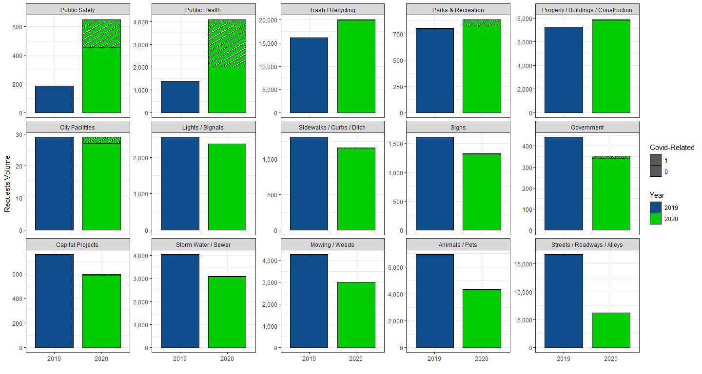

Did COVID-19 Induce A Strenuous Effect on the 311 Non-Emergency Services
System?
================

``` r
#load library
library(dplyr)
library(reshape2)
library(openxlsx)
library(car)
library(ggplot2)
library(hrbrthemes)
library(viridis)
library(ggpattern)
library(plm)
library(haven)
library(texreg)
library(lfe)
#install.packages("devtools")
#library(devtools)
#install_github('arilamstein/choroplethrZip@v1.3.0')
library(choroplethrZip)

#load 311 data 
load("kcmo2019_2020.rdata")

#load 911 data
dat911 = read.csv("kcmo 911 volume - data.csv")
 
#covid cases by zipcode as of january 15, 2022
zip_covid = read.csv("COVID-19_Data_by_ZIP_Code.csv") 
zip_covid = zip_covid %>% dplyr::select(ZipCode,Cases,Total.Residents.Tested) %>% mutate(ZIP = ZipCode,rate = Cases/Total.Residents.Tested ) %>% dplyr::select(ZIP, rate)
```

``` r
# create year+month var
dat$date = dat$CREATEYR*100 +dat$CREATEMO

dat$date = as.Date(as.character(dat$date*100+1),"%Y%m%d")

# create covid related calls 
dat = dat %>%
  mutate(
    
    covid = as.numeric(grepl("covid",tolower(description))|
                         grepl("corona",tolower(description))|
                         grepl("pandemic",tolower(description))|
                         grepl("virus",tolower(description))|
                         grepl("positive",tolower(description))
    ),
    
    mask = as.numeric(grepl("mask",tolower(description))|
                        grepl("face cover",tolower(description))|
                        grepl("ppe ",tolower(description))|
                        grepl("coverings",tolower(description))
    ),
    
    sdistance = as.numeric(grepl("social",tolower(description))|
                             grepl("distanc",tolower(description))|
                             grepl("6 feet",tolower(description))|
                             grepl("quarantine",tolower(description))|
                             grepl("stay at home",tolower(description))|
                             grepl("gathering",tolower(description))
    ),
    
    essential = as.numeric(grepl("essential",tolower(description))|
                             grepl("still open",tolower(description))|
                             grepl("open for business",tolower(description))|
                             grepl("open and operating",tolower(description))|
                             grepl("still operating",tolower(description))
    ), 
    
    allcovid = as.numeric((covid==1|mask==1|sdistance==1|essential==1) & season == "COVID-warm")
  )
```

Aggregate Trends

Call Volumes

``` r
dat %>% 
  group_by(date,CREATEYR,CREATEMO,allcovid) %>%
  count() %>% 
  filter(CREATEMO %in% 3:8) %>%
  mutate(CREATEYR = as.factor(CREATEYR),allcovid = as.factor(allcovid) )%>%
  ggplot(aes(x = CREATEMO, y = n,  group = CREATEYR, fill = CREATEYR))+
  geom_col_pattern(aes(pattern = reorder(allcovid,n)),position = position_dodge(),
                   col="black",width = 0.8)+
  scale_fill_manual(values = c("dodgerblue4","green3"))+
  scale_pattern_manual(values=c("stripe","none"))+
  scale_x_continuous(breaks = 3:8)+
  scale_y_continuous(labels =scales::comma)+
  labs(y = "Requests Volume",
       x = "Month",
       fill = "Year",
       pattern = "Covid-Related"
       )+
  theme_bw()
```

<!-- -->

Call Volumes by Request Types

``` r
# changes in request volume after covid by categories 
diff = dat %>% 
  filter(CATEGORY != "Data Not Available") %>%
  filter(CREATEMO %in% 3:8) %>%
  group_by(CREATEYR,CATEGORY) %>%
  count() %>% 
  dcast(CATEGORY~CREATEYR) %>% 
  mutate(diff = `2020`-`2019`,
         diff_pchg = `2020`/`2019` )

# plot request volume by categories
dat %>% 
  filter(CATEGORY != "Data Not Available") %>%
  filter(CREATEMO %in% 3:8) %>%
  group_by(CREATEYR,allcovid,CATEGORY) %>%
  count() %>% 
  left_join(diff)%>%
  mutate(CREATEYR = as.factor(CREATEYR),allcovid = as.factor(allcovid) )%>%
  ggplot(aes(x = CREATEYR, y = n,  group = reorder(CREATEYR,n), fill = CREATEYR))+
  geom_col_pattern(aes(pattern = reorder(allcovid,n)),#position = position_dodge(),
                   col="black",width = 0.8)+
  facet_wrap(~reorder(CATEGORY,-diff_pchg), scale = "free_y", ncol = 5)+
  scale_fill_manual(values = c("dodgerblue4","green3"))+
  scale_pattern_manual(values=c("stripe","none"))+
  scale_y_continuous(labels =scales::comma)+
  labs(y = "Requests Volume",
       x = "",
       fill = "Year",
       pattern = "Covid-Related"
       )+
  theme_bw()
```

<!-- -->

``` r
# plot response time by categories
dat %>% 
  filter(CATEGORY != "Data Not Available") %>%
  #filter(CATEGORY %in% c("Public Safety","Public Health","Parks & Recreation")) %>%
  filter(CREATEMO %in% 3:8) %>%
  filter(allcovid==0) %>%
  left_join(diff)%>%
  mutate(CREATEYR = as.factor(CREATEYR))%>%
  group_by(CREATEYR, CATEGORY,diff_pchg) %>% summarize(DAYTOCLOSE = mean(DAYTOCLOSE)) %>% 
  ggplot(aes(x = CREATEYR, y = DAYTOCLOSE, fill = CREATEYR))+
  geom_col(#outlier.shape = NA,
               show.legend = FALSE)+
  facet_wrap(~reorder(CATEGORY,-diff_pchg), ncol = 5,scale="free")+
  scale_fill_manual(values = c("dodgerblue4","green3"))+
  #ylim(c(0,80))+
  labs(x = "",
       y = "Average Reponse Time",
       fill = "Year",
       pattern = "Covid-Related"
       )+
  theme_bw()
```

<!-- -->

Zip Code Variation

``` r
# yoy change in days to close
zip_dtc = dat %>% 
  filter(CATEGORY %in% c("Public Safety","Public Health","Parks & Recreation")) %>%
  filter(CREATEMO %in% 3:8) %>%
  group_by(CREATEYR,CATEGORY, ZIP) %>%
  summarize(daytoclose = mean(DAYTOCLOSE,na.rm=T)) %>%
  dcast(CATEGORY + ZIP ~ CREATEYR) %>% 
  mutate(daytoclose_diff = `2020`-`2019`)%>% rename(daytoclose_2020 = `2020`,daytoclose_2019=`2019`)
```

    ## `summarise()` has grouped output by 'CREATEYR', 'CATEGORY'. You can override using the `.groups` argument.

    ## Using daytoclose as value column: use value.var to override.

``` r
# yoy change in volume
zip_n = dat %>% 
  filter(CATEGORY %in% c("Public Safety","Public Health","Parks & Recreation")) %>%
  filter(CREATEMO %in% 3:8) %>%
  group_by(CREATEYR,CATEGORY, ZIP) %>%
  summarize(n = n()) %>%
  dcast(CATEGORY + ZIP ~ CREATEYR) %>% 
  mutate(n_diff = `2020`-`2019`,
         n_pchg = (`2020` / `2019`-1)*100)  %>% rename(n_2020 = `2020`,n_2019=`2019`)
```

    ## `summarise()` has grouped output by 'CREATEYR', 'CATEGORY'. You can override using the `.groups` argument.

    ## Using n as value column: use value.var to override.

``` r
#merge data 
zip = zip_dtc %>% left_join(zip_n) %>%
  left_join(zip_covid)
```

    ## Joining, by = c("CATEGORY", "ZIP")

    ## Joining, by = "ZIP"

``` r
#list of zip to zoom in
zip_kcmo = unique(as.character(zip_covid$ZIP))

#zip code choropleth for covid infection rate
zip_choropleth(zip_covid %>% mutate(region = as.character(ZIP), value = rate*100), 
               #state_zoom = ec_states, 
               zip_zoom = zip_kcmo,
               title      = "",
               legend     = "COVID-19 Infection Rate") + coord_map()   
```

    ## Coordinate system already present. Adding new coordinate system, which will replace the existing one.

<!-- -->

``` r
# #scatterplot
# zip %>% 
#   ggplot(aes(y = n_diff, x = rate, size = n_2019, col = ZIP))+
#   geom_point()+
#   geom_smooth(method=lm)+
#   facet_wrap(~CATEGORY, scale = "free_y")+
#   theme_bw()+
#   theme(legend.position = "none")
```

``` r
#scatter plot
zip %>% 
  ggplot(aes(y = daytoclose_diff, x = rate, size = daytoclose_2019, col = ZIP))+
  geom_point()+
  geom_smooth(method=lm)+
  facet_wrap(~CATEGORY, scale = "free_y")+
  labs(y = "Change in Response Time",x = "COVID-19 infection rate")+
  theme_bw()+
  theme(legend.position = "none")
```

    ## `geom_smooth()` using formula 'y ~ x'

    ## Warning: Removed 21 rows containing non-finite values (stat_smooth).

    ## Warning: Removed 21 rows containing missing values (geom_point).

<!-- -->

``` r
# #scatterplot
# zip %>% 
#   ggplot(aes(y = daytoclose_diff, x = n_diff, size = n_2019, col = ZIP))+
#   geom_point()+
#   geom_smooth(method=lm)+
#   facet_wrap(~CATEGORY, scale = "free")+
#   theme_bw()+
#   theme(legend.position = "none")
```

``` r
# covid related request by zip code 
zip_covid_311 = dat %>% group_by(ZIP) %>% 
  summarise(n_allcovid = sum(allcovid))

# create data for request level reg
dat_reg = dat %>% 
  left_join(zip_covid) %>%
  left_join(zip_covid_311) %>% 
  mutate(after = as.numeric(season == "COVID-warm"),
         rate = rate*100) %>% 
  filter(allcovid==0) %>% 
  mutate(did = rate*after,
         did2 = n_allcovid*after)
```

    ## Joining, by = "ZIP"
    ## Joining, by = "ZIP"

``` r
#ols 
reg_ols = (lm(data= dat_reg, DAYTOCLOSE~did + rate + after))
#fe: rate + after
reg_fe_a = (felm(data = dat_reg,DAYTOCLOSE~did|rate+after ))
#fe: rate + date(year-month)
reg_fe_b = (felm(data = dat_reg,DAYTOCLOSE~did|rate+factor(date) ))

#combine reg 
screenreg(list(reg_ols, reg_fe_a, reg_fe_b), 
          omit.coef = "after|rate|Intercept", digits=4, 
          include.rsquared = FALSE, include.adjrs = FALSE, include.rmse = FALSE,
          custom.model.names = c("OLS", "FE period-rate", "FE date-rate"),
          custom.coef.names = "DiD effect"
          )
```

    ## 
    ## =====================================================================
    ##                            OLS           FE period-rate  FE date-rate
    ## ---------------------------------------------------------------------
    ## DiD effect                     -0.1749       -0.1674         -0.2834 
    ##                                (0.1472)      (0.1468)        (0.1457)
    ## ---------------------------------------------------------------------
    ## Num. obs.                  170259        170259          170259      
    ## Num. groups: rate                            49              49      
    ## Num. groups: after                            2                      
    ## Num. groups: factor(date)                                    18      
    ## =====================================================================
    ## *** p < 0.001; ** p < 0.01; * p < 0.05

``` r
#ols 
reg_ols = (lm(data= dat_reg[dat_reg$CATEGORY == "Public Health",], DAYTOCLOSE~did + rate + after))
#fe: rate + after
reg_fe_a = (felm(data = dat_reg[dat_reg$CATEGORY == "Public Health",],DAYTOCLOSE~did|rate+after ))
#fe: rate + date(year-month)
reg_fe_b = (felm(data = dat_reg[dat_reg$CATEGORY == "Public Health",],DAYTOCLOSE~did|rate+factor(date) ))

#combine reg 
screenreg(list(reg_ols, reg_fe_a, reg_fe_b), 
          omit.coef = "after|rate|Intercept", digits=4, 
          include.rsquared = FALSE, include.adjrs = FALSE, include.rmse = FALSE,
          custom.model.names = c("OLS", "FE period-rate", "FE date-rate"),
          custom.coef.names = "DiD effect"
          )
```

    ## 
    ## ===================================================================
    ##                            OLS         FE period-rate  FE date-rate
    ## -------------------------------------------------------------------
    ## DiD effect                   -0.0526     -0.0448         -0.0852   
    ##                              (0.4476)    (0.4506)        (0.4405)  
    ## -------------------------------------------------------------------
    ## Num. obs.                  4804        4804            4804        
    ## Num. groups: rate                        44              44        
    ## Num. groups: after                        2                        
    ## Num. groups: factor(date)                                18        
    ## ===================================================================
    ## *** p < 0.001; ** p < 0.01; * p < 0.05

``` r
#ols 
reg_ols = (lm(data= dat_reg[dat_reg$CATEGORY == "Public Safety",], DAYTOCLOSE~did + rate + after))
#fe: rate + after
reg_fe_a = (felm(data = dat_reg[dat_reg$CATEGORY == "Public Safety",],DAYTOCLOSE~did|rate+after ))
#fe: rate + date(year-month)
reg_fe_b = (felm(data = dat_reg[dat_reg$CATEGORY == "Public Safety",],DAYTOCLOSE~did|rate+factor(date) ))

#combine reg 
screenreg(list(reg_ols, reg_fe_a, reg_fe_b), 
          omit.coef = "after|rate|Intercept", digits=4, 
          include.rsquared = FALSE, include.adjrs = FALSE, include.rmse = FALSE,
          custom.model.names = c("OLS", "FE period-rate", "FE date-rate"),
          custom.coef.names = "DiD effect"
          )
```

    ## 
    ## ==================================================================
    ##                            OLS        FE period-rate  FE date-rate
    ## ------------------------------------------------------------------
    ## DiD effect                   0.4422     0.9210          1.0199    
    ##                             (0.9619)   (1.0150)        (0.9913)   
    ## ------------------------------------------------------------------
    ## Num. obs.                  853        853             853         
    ## Num. groups: rate                      41              41         
    ## Num. groups: after                      2                         
    ## Num. groups: factor(date)                              18         
    ## ==================================================================
    ## *** p < 0.001; ** p < 0.01; * p < 0.05

``` r
#ols 
reg_ols = (lm(data= dat_reg[dat_reg$CATEGORY == "Parks & Recreation",], DAYTOCLOSE~did + rate + after))
#fe: rate + after
reg_fe_a = (felm(data = dat_reg[dat_reg$CATEGORY == "Parks & Recreation",],DAYTOCLOSE~did|rate+after ))
#fe: rate + date(year-month)
reg_fe_b = (felm(data = dat_reg[dat_reg$CATEGORY == "Parks & Recreation",],DAYTOCLOSE~did|rate+factor(date) ))

#combine reg 
screenreg(list(reg_ols, reg_fe_a, reg_fe_b), 
          omit.coef = "after|rate|Intercept", digits=4, 
          include.rsquared = FALSE, include.adjrs = FALSE, include.rmse = FALSE,
          custom.model.names = c("OLS", "FE period-rate", "FE date-rate"),
          custom.coef.names = "DiD effect"
          )
```

    ## 
    ## ======================================================================
    ##                            OLS           FE period-rate  FE date-rate 
    ## ----------------------------------------------------------------------
    ## DiD effect                    3.3369 **     3.3516 **       4.1238 ***
    ##                              (1.1511)      (1.1606)        (1.1095)   
    ## ----------------------------------------------------------------------
    ## Num. obs.                  2097          2097            2097         
    ## Num. groups: rate                          38              38         
    ## Num. groups: after                          2                         
    ## Num. groups: factor(date)                                  18         
    ## ======================================================================
    ## *** p < 0.001; ** p < 0.01; * p < 0.05

``` r
#ols 
reg_ols = (lm(data= dat_reg, DAYTOCLOSE~did2 + n_allcovid + after))
#fe: rate + after
reg_fe_a = (felm(data = dat_reg,DAYTOCLOSE~did2|n_allcovid+after ))
#fe: rate + date(year-month)
reg_fe_b = (felm(data = dat_reg,DAYTOCLOSE~did2|n_allcovid+factor(date) ))

#combine reg 
screenreg(list(reg_ols, reg_fe_a, reg_fe_b), 
          omit.coef = "after|n_allcovid|Intercept", digits=4, 
          include.rsquared = FALSE, include.adjrs = FALSE, include.rmse = FALSE,
          custom.model.names = c("OLS", "FE period-rate", "FE date-rate"),
          custom.coef.names = "DiD effect"
          )
```

    ## 
    ## =========================================================================
    ##                            OLS             FE period-rate  FE date-rate  
    ## -------------------------------------------------------------------------
    ## DiD effect                      0.0159 **       0.0186 **       0.0165 **
    ##                                (0.0058)        (0.0058)        (0.0057)  
    ## -------------------------------------------------------------------------
    ## Num. obs.                  170261          170261          170261        
    ## Num. groups: n_allcovid                        41              41        
    ## Num. groups: after                              2                        
    ## Num. groups: factor(date)                                      18        
    ## =========================================================================
    ## *** p < 0.001; ** p < 0.01; * p < 0.05

``` r
#ols 
reg_ols = (lm(data= dat_reg[dat_reg$CATEGORY == "Public Health",], DAYTOCLOSE~did2 + n_allcovid + after))
#fe: rate + after
reg_fe_a = (felm(data = dat_reg[dat_reg$CATEGORY == "Public Health",],DAYTOCLOSE~did2|n_allcovid+after ))
#fe: rate + date(year-month)
reg_fe_b = (felm(data = dat_reg[dat_reg$CATEGORY == "Public Health",],DAYTOCLOSE~did2|n_allcovid+factor(date) ))

#combine reg 
screenreg(list(reg_ols, reg_fe_a, reg_fe_b), 
          omit.coef = "after|n_allcovid|Intercept", digits=4, 
          include.rsquared = FALSE, include.adjrs = FALSE, include.rmse = FALSE,
          custom.model.names = c("OLS", "FE period-rate", "FE date-rate"),
          custom.coef.names = "DiD effect"
          )
```

    ## 
    ## ===================================================================
    ##                            OLS         FE period-rate  FE date-rate
    ## -------------------------------------------------------------------
    ## DiD effect                    0.0029      0.0030          0.0004   
    ##                              (0.0175)    (0.0176)        (0.0172)  
    ## -------------------------------------------------------------------
    ## Num. obs.                  4805        4805            4805        
    ## Num. groups: n_allcovid                  41              41        
    ## Num. groups: after                        2                        
    ## Num. groups: factor(date)                                18        
    ## ===================================================================
    ## *** p < 0.001; ** p < 0.01; * p < 0.05

``` r
#ols 
reg_ols = (lm(data= dat_reg[dat_reg$CATEGORY == "Public Safety",], DAYTOCLOSE~did2 + n_allcovid + after))
#fe: rate + after
reg_fe_a = (felm(data = dat_reg[dat_reg$CATEGORY == "Public Safety",],DAYTOCLOSE~did2|n_allcovid+after ))
#fe: rate + date(year-month)
reg_fe_b = (felm(data = dat_reg[dat_reg$CATEGORY == "Public Safety",],DAYTOCLOSE~did2|n_allcovid+factor(date) ))

#combine reg 
screenreg(list(reg_ols, reg_fe_a, reg_fe_b), 
          omit.coef = "after|n_allcovid|Intercept", digits=4, 
          include.rsquared = FALSE, include.adjrs = FALSE, include.rmse = FALSE,
          custom.model.names = c("OLS", "FE period-rate", "FE date-rate"),
          custom.coef.names = "DiD effect"
          )
```

    ## 
    ## ==================================================================
    ##                            OLS        FE period-rate  FE date-rate
    ## ------------------------------------------------------------------
    ## DiD effect                  -0.0191    -0.0324         -0.0285    
    ##                             (0.0520)   (0.0543)        (0.0532)   
    ## ------------------------------------------------------------------
    ## Num. obs.                  853        853             853         
    ## Num. groups: n_allcovid                39              39         
    ## Num. groups: after                      2                         
    ## Num. groups: factor(date)                              18         
    ## ==================================================================
    ## *** p < 0.001; ** p < 0.01; * p < 0.05

``` r
#ols 
reg_ols = (lm(data= dat_reg[dat_reg$CATEGORY == "Parks & Recreation",], DAYTOCLOSE~did2 + n_allcovid + after))
#fe: rate + after
reg_fe_a = (felm(data = dat_reg[dat_reg$CATEGORY == "Parks & Recreation",], DAYTOCLOSE~did2|n_allcovid + after ))
#fe: rate + date(year-month)
reg_fe_b = (felm(data = dat_reg[dat_reg$CATEGORY == "Parks & Recreation",], DAYTOCLOSE~did2|n_allcovid + factor(date) ))

#combine reg 
screenreg(list(reg_ols, reg_fe_a, reg_fe_b), 
          omit.coef = "after|n_allcovid|Intercept", digits=4, 
          include.rsquared = FALSE, include.adjrs = FALSE, include.rmse = FALSE,
          custom.model.names = c("OLS", "FE period-rate", "FE date-rate"),
          custom.coef.names = "DiD effect"
          )
```

    ## 
    ## ===================================================================
    ##                            OLS         FE period-rate  FE date-rate
    ## -------------------------------------------------------------------
    ## DiD effect                   -0.0257     -0.0328         -0.0344   
    ##                              (0.0438)    (0.0433)        (0.0415)  
    ## -------------------------------------------------------------------
    ## Num. obs.                  2097        2097            2097        
    ## Num. groups: n_allcovid                  36              36        
    ## Num. groups: after                        2                        
    ## Num. groups: factor(date)                                18        
    ## ===================================================================
    ## *** p < 0.001; ** p < 0.01; * p < 0.05

``` r
zip_reg = dat %>% 
  mutate(after = as.numeric(season == "COVID-warm")) %>% 
  filter(allcovid==0) %>% 
  #filter(CATEGORY == "Public Health") %>%
  group_by(date, ZIP, after) %>%
  summarise(DAYTOCLOSE = mean(DAYTOCLOSE,na.rm=T)) %>% 
  left_join(zip_covid) %>%
  left_join(zip_covid_311) %>%
  mutate(rate = rate*100,
         did = rate*after,
         did2 = n_allcovid*after)
```

    ## `summarise()` has grouped output by 'date', 'ZIP'. You can override using the `.groups` argument.

    ## Joining, by = "ZIP"
    ## Joining, by = "ZIP"

``` r
#ols 
reg_ols = (lm(data= zip_reg, DAYTOCLOSE~did + rate + after))
#fe: rate + after
reg_fe_a = (felm(data = zip_reg,DAYTOCLOSE~did|rate+after ))
#fe: rate + date(year-month)
reg_fe_b = (felm(data = zip_reg,DAYTOCLOSE~did|rate+factor(date) ))

#combine reg 
screenreg(list(reg_ols, reg_fe_a, reg_fe_b), 
          omit.coef = "after|rate|Intercept", digits=4, 
          include.rsquared = FALSE, include.adjrs = FALSE, include.rmse = FALSE,
          custom.model.names = c("OLS", "FE period-rate", "FE date-rate"),
          custom.coef.names = "DiD effect"
          )
```

    ## 
    ## ==================================================================
    ##                            OLS        FE period-rate  FE date-rate
    ## ------------------------------------------------------------------
    ## DiD effect                  -0.1976    -0.1724         -0.2225    
    ##                             (0.4923)   (0.4608)        (0.4047)   
    ## ------------------------------------------------------------------
    ## Num. obs.                  873        873             873         
    ## Num. groups: rate                      49              49         
    ## Num. groups: after                      2                         
    ## Num. groups: factor(date)                              18         
    ## ==================================================================
    ## *** p < 0.001; ** p < 0.01; * p < 0.05

``` r
zip_reg = dat %>% 
  mutate(after = as.numeric(season == "COVID-warm")) %>% 
  filter(allcovid==0) %>% 
  filter(CATEGORY == "Public Health") %>%
  group_by(date, ZIP, after) %>%
  summarise(DAYTOCLOSE = mean(DAYTOCLOSE,na.rm=T)) %>% 
  left_join(zip_covid) %>%
  left_join(zip_covid_311) %>%
  mutate(rate = rate*100,
         did = rate*after,
         did2 = n_allcovid*after)
```

    ## `summarise()` has grouped output by 'date', 'ZIP'. You can override using the `.groups` argument.

    ## Joining, by = "ZIP"
    ## Joining, by = "ZIP"

``` r
#ols 
reg_ols = (lm(data= zip_reg, DAYTOCLOSE~did + rate + after))
#fe: rate + after
reg_fe_a = (felm(data = zip_reg,DAYTOCLOSE~did|rate+after ))
#fe: rate + date(year-month)
reg_fe_b = (felm(data = zip_reg,DAYTOCLOSE~did|rate+factor(date) ))

#combine reg 
screenreg(list(reg_ols, reg_fe_a, reg_fe_b), 
          omit.coef = "after|rate|Intercept", digits=4, 
          include.rsquared = FALSE, include.adjrs = FALSE, include.rmse = FALSE,
          custom.model.names = c("OLS", "FE period-rate", "FE date-rate"),
          custom.coef.names = "DiD effect"
          )
```

    ## 
    ## ==================================================================
    ##                            OLS        FE period-rate  FE date-rate
    ## ------------------------------------------------------------------
    ## DiD effect                   0.8055     0.8299          0.7601    
    ##                             (0.5907)   (0.5915)        (0.5454)   
    ## ------------------------------------------------------------------
    ## Num. obs.                  664        664             664         
    ## Num. groups: rate                      44              44         
    ## Num. groups: after                      2                         
    ## Num. groups: factor(date)                              18         
    ## ==================================================================
    ## *** p < 0.001; ** p < 0.01; * p < 0.05

``` r
zip_reg = dat %>% 
  mutate(after = as.numeric(season == "COVID-warm")) %>% 
  filter(allcovid==0) %>% 
  filter(CATEGORY == "Public Safety") %>%
  group_by(date, ZIP, after) %>%
  summarise(DAYTOCLOSE = mean(DAYTOCLOSE,na.rm=T)) %>% 
  left_join(zip_covid) %>%
  left_join(zip_covid_311) %>%
  mutate(rate = rate*100,
         did = rate*after,
         did2 = n_allcovid*after)
```

    ## `summarise()` has grouped output by 'date', 'ZIP'. You can override using the `.groups` argument.

    ## Joining, by = "ZIP"
    ## Joining, by = "ZIP"

``` r
#ols 
reg_ols = (lm(data= zip_reg, DAYTOCLOSE~did + rate + after))
#fe: rate + after
reg_fe_a = (felm(data = zip_reg,DAYTOCLOSE~did|rate+after ))
#fe: rate + date(year-month)
reg_fe_b = (felm(data = zip_reg,DAYTOCLOSE~did|rate+factor(date) ))

#combine reg 
screenreg(list(reg_ols, reg_fe_a, reg_fe_b), 
          omit.coef = "after|rate|Intercept", digits=4, 
          include.rsquared = FALSE, include.adjrs = FALSE, include.rmse = FALSE,
          custom.model.names = c("OLS", "FE period-rate", "FE date-rate"),
          custom.coef.names = "DiD effect"
          )
```

    ## 
    ## ==================================================================
    ##                            OLS        FE period-rate  FE date-rate
    ## ------------------------------------------------------------------
    ## DiD effect                   0.7901     0.7898          1.0353    
    ##                             (1.1737)   (1.1835)        (1.1661)   
    ## ------------------------------------------------------------------
    ## Num. obs.                  343        343             343         
    ## Num. groups: rate                      41              41         
    ## Num. groups: after                      2                         
    ## Num. groups: factor(date)                              18         
    ## ==================================================================
    ## *** p < 0.001; ** p < 0.01; * p < 0.05

``` r
zip_reg = dat %>% 
  mutate(after = as.numeric(season == "COVID-warm")) %>% 
  filter(allcovid==0) %>% 
  filter(CATEGORY == "Parks & Recreation") %>%
  group_by(date, ZIP, after) %>%
  summarise(DAYTOCLOSE = mean(DAYTOCLOSE,na.rm=T)) %>% 
  left_join(zip_covid) %>%
  left_join(zip_covid_311) %>%
  mutate(rate = rate*100,
         did = rate*after,
         did2 = n_allcovid*after)
```

    ## `summarise()` has grouped output by 'date', 'ZIP'. You can override using the `.groups` argument.

    ## Joining, by = "ZIP"
    ## Joining, by = "ZIP"

``` r
#ols 
reg_ols = (lm(data= zip_reg, DAYTOCLOSE~did + rate + after))
#fe: rate + after
reg_fe_a = (felm(data = zip_reg,DAYTOCLOSE~did|rate+after ))
#fe: rate + date(year-month)
reg_fe_b = (felm(data = zip_reg,DAYTOCLOSE~did|rate+factor(date) ))

#combine reg 
screenreg(list(reg_ols, reg_fe_a, reg_fe_b), 
          omit.coef = "after|rate|Intercept", digits=4, 
          include.rsquared = FALSE, include.adjrs = FALSE, include.rmse = FALSE,
          custom.model.names = c("OLS", "FE period-rate", "FE date-rate"),
          custom.coef.names = "DiD effect"
          )
```

    ## 
    ## ==================================================================
    ##                            OLS        FE period-rate  FE date-rate
    ## ------------------------------------------------------------------
    ## DiD effect                   2.0553     1.9024          2.5739    
    ##                             (1.5904)   (1.6129)        (1.4718)   
    ## ------------------------------------------------------------------
    ## Num. obs.                  487        487             487         
    ## Num. groups: rate                      38              38         
    ## Num. groups: after                      2                         
    ## Num. groups: factor(date)                              18         
    ## ==================================================================
    ## *** p < 0.001; ** p < 0.01; * p < 0.05

``` r
zip_reg = dat %>% 
  mutate(after = as.numeric(season == "COVID-warm")) %>% 
  filter(allcovid==0) %>% 
  #filter(CATEGORY == "Public Health") %>%
  group_by(date, ZIP, after) %>%
  summarise(DAYTOCLOSE = mean(DAYTOCLOSE,na.rm=T)) %>% 
  left_join(zip_covid) %>%
  left_join(zip_covid_311) %>%
  mutate(rate = rate*100,
         did = rate*after,
         did2 = n_allcovid*after)
```

    ## `summarise()` has grouped output by 'date', 'ZIP'. You can override using the `.groups` argument.

    ## Joining, by = "ZIP"
    ## Joining, by = "ZIP"

``` r
#ols 
reg_ols = (lm(data= zip_reg, DAYTOCLOSE~did2 + n_allcovid + after))
#fe: rate + after
reg_fe_a = (felm(data = zip_reg,DAYTOCLOSE~did2|n_allcovid+after ))
#fe: rate + date(year-month)
reg_fe_b = (felm(data = zip_reg,DAYTOCLOSE~did2|n_allcovid+factor(date) ))

#combine reg 
screenreg(list(reg_ols, reg_fe_a, reg_fe_b), 
          omit.coef = "after|n_allcovid|Intercept", digits=4, 
          include.rsquared = FALSE, include.adjrs = FALSE, include.rmse = FALSE,
          custom.model.names = c("OLS", "FE period-rate", "FE date-rate"),
          custom.coef.names = "DiD effect"
          )
```

    ## 
    ## ==================================================================
    ##                            OLS        FE period-rate  FE date-rate
    ## ------------------------------------------------------------------
    ## DiD effect                   0.0444     0.0446          0.0425 *  
    ##                             (0.0248)   (0.0239)        (0.0213)   
    ## ------------------------------------------------------------------
    ## Num. obs.                  875        875             875         
    ## Num. groups: n_allcovid                41              41         
    ## Num. groups: after                      2                         
    ## Num. groups: factor(date)                              18         
    ## ==================================================================
    ## *** p < 0.001; ** p < 0.01; * p < 0.05

``` r
zip_reg = dat %>% 
  mutate(after = as.numeric(season == "COVID-warm")) %>% 
  filter(allcovid==0) %>% 
  filter(CATEGORY == "Public Health") %>%
  group_by(date, ZIP, after) %>%
  summarise(DAYTOCLOSE = mean(DAYTOCLOSE,na.rm=T)) %>% 
  left_join(zip_covid) %>%
  left_join(zip_covid_311) %>%
  mutate(rate = rate*100,
         did = rate*after,
         did2 = n_allcovid*after)
```

    ## `summarise()` has grouped output by 'date', 'ZIP'. You can override using the `.groups` argument.

    ## Joining, by = "ZIP"
    ## Joining, by = "ZIP"

``` r
#ols 
reg_ols = (lm(data= zip_reg, DAYTOCLOSE~did2 + n_allcovid + after))
#fe: rate + after
reg_fe_a = (felm(data = zip_reg,DAYTOCLOSE~did2|n_allcovid+after ))
#fe: rate + date(year-month)
reg_fe_b = (felm(data = zip_reg,DAYTOCLOSE~did2|n_allcovid+factor(date) ))

#combine reg 
screenreg(list(reg_ols, reg_fe_a, reg_fe_b), 
          omit.coef = "after|n_allcovid|Intercept", digits=4, 
          include.rsquared = FALSE, include.adjrs = FALSE, include.rmse = FALSE,
          custom.model.names = c("OLS", "FE period-rate", "FE date-rate"),
          custom.coef.names = "DiD effect"
          )
```

    ## 
    ## ==================================================================
    ##                            OLS        FE period-rate  FE date-rate
    ## ------------------------------------------------------------------
    ## DiD effect                  -0.0305    -0.0296         -0.0251    
    ##                             (0.0296)   (0.0299)        (0.0277)   
    ## ------------------------------------------------------------------
    ## Num. obs.                  665        665             665         
    ## Num. groups: n_allcovid                41              41         
    ## Num. groups: after                      2                         
    ## Num. groups: factor(date)                              18         
    ## ==================================================================
    ## *** p < 0.001; ** p < 0.01; * p < 0.05

``` r
zip_reg = dat %>% 
  mutate(after = as.numeric(season == "COVID-warm")) %>% 
  filter(allcovid==0) %>% 
  filter(CATEGORY == "Public Safety") %>%
  group_by(date, ZIP, after) %>%
  summarise(DAYTOCLOSE = mean(DAYTOCLOSE,na.rm=T)) %>% 
  left_join(zip_covid) %>%
  left_join(zip_covid_311) %>%
  mutate(rate = rate*100,
         did = rate*after,
         did2 = n_allcovid*after)
```

    ## `summarise()` has grouped output by 'date', 'ZIP'. You can override using the `.groups` argument.

    ## Joining, by = "ZIP"
    ## Joining, by = "ZIP"

``` r
#ols 
reg_ols = (lm(data= zip_reg, DAYTOCLOSE~did2 + n_allcovid + after))
#fe: rate + after
reg_fe_a = (felm(data = zip_reg,DAYTOCLOSE~did2|n_allcovid+after ))
#fe: rate + date(year-month)
reg_fe_b = (felm(data = zip_reg,DAYTOCLOSE~did2|n_allcovid+factor(date) ))

#combine reg 
screenreg(list(reg_ols, reg_fe_a, reg_fe_b), 
          omit.coef = "after|n_allcovid|Intercept", digits=4, 
          include.rsquared = FALSE, include.adjrs = FALSE, include.rmse = FALSE,
          custom.model.names = c("OLS", "FE period-rate", "FE date-rate"),
          custom.coef.names = "DiD effect"
          )
```

    ## 
    ## ==================================================================
    ##                            OLS        FE period-rate  FE date-rate
    ## ------------------------------------------------------------------
    ## DiD effect                  -0.0613    -0.0445         -0.0483    
    ##                             (0.0602)   (0.0607)        (0.0598)   
    ## ------------------------------------------------------------------
    ## Num. obs.                  343        343             343         
    ## Num. groups: n_allcovid                39              39         
    ## Num. groups: after                      2                         
    ## Num. groups: factor(date)                              18         
    ## ==================================================================
    ## *** p < 0.001; ** p < 0.01; * p < 0.05

``` r
zip_reg = dat %>% 
  mutate(after = as.numeric(season == "COVID-warm")) %>% 
  filter(allcovid==0) %>% 
  filter(CATEGORY == "Parks & Recreation") %>%
  group_by(date, ZIP, after) %>%
  summarise(DAYTOCLOSE = mean(DAYTOCLOSE,na.rm=T)) %>% 
  left_join(zip_covid) %>%
  left_join(zip_covid_311) %>%
  mutate(rate = rate*100,
         did = rate*after,
         did2 = n_allcovid*after)
```

    ## `summarise()` has grouped output by 'date', 'ZIP'. You can override using the `.groups` argument.

    ## Joining, by = "ZIP"
    ## Joining, by = "ZIP"

``` r
#ols 
reg_ols = (lm(data= zip_reg, DAYTOCLOSE~did2 + n_allcovid + after))
#fe: rate + after
reg_fe_a = (felm(data = zip_reg,DAYTOCLOSE~did2|n_allcovid+after ))
#fe: rate + date(year-month)
reg_fe_b = (felm(data = zip_reg,DAYTOCLOSE~did2|n_allcovid+factor(date) ))

#combine reg 
screenreg(list(reg_ols, reg_fe_a, reg_fe_b), 
          omit.coef = "after|n_allcovid|Intercept", digits=4, 
          include.rsquared = FALSE, include.adjrs = FALSE, include.rmse = FALSE,
          custom.model.names = c("OLS", "FE period-rate", "FE date-rate"),
          custom.coef.names = "DiD effect"
          )
```

    ## 
    ## ==================================================================
    ##                            OLS        FE period-rate  FE date-rate
    ## ------------------------------------------------------------------
    ## DiD effect                  -0.0709    -0.0772         -0.0730    
    ##                             (0.0700)   (0.0686)        (0.0626)   
    ## ------------------------------------------------------------------
    ## Num. obs.                  487        487             487         
    ## Num. groups: n_allcovid                36              36         
    ## Num. groups: after                      2                         
    ## Num. groups: factor(date)                              18         
    ## ==================================================================
    ## *** p < 0.001; ** p < 0.01; * p < 0.05

``` r
zip_covid %>% left_join(zip_covid_311) %>%
  ggplot(aes(x = rate, y = n_allcovid))+ 
  geom_point()+
  geom_smooth(method=lm)+
  labs(x= "COVID-19 infection rate", y="Volume of covid-related requests")+
  theme_bw()
```

    ## Joining, by = "ZIP"

    ## `geom_smooth()` using formula 'y ~ x'

    ## Warning: Removed 1 rows containing non-finite values (stat_smooth).

    ## Warning: Removed 1 rows containing missing values (geom_point).

<!-- -->

Discussion

Categories vs Departments

``` r
dat %>%
  filter(CATEGORY != "Data Not Available") %>%
  filter(CREATEMO %in% 3:8) %>%
  group_by(CATEGORY, DEPT) %>%
  count() %>%
  left_join(diff)%>%
  mutate(selected = CATEGORY %in% c("Public Health","Public Safety","Parks & Recreation"))%>%
  ggplot(aes(x = reorder(CATEGORY,-diff_pchg), y = DEPT, fill = n, col = selected))+
  geom_tile(lwd=1.5)+
  scale_x_discrete(guide = guide_axis(angle = 90))+
  scale_color_manual(values=c("white","red"))+
  labs(
    y = "Department",
    x = "Category",
    fill = "Request Volume",
    col = "Selected Catgories"
  )+
  theme_bw()
```

    ## Joining, by = "CATEGORY"

<!-- -->

911 trends

``` r
dat911 %>% 
  filter(month %in% 3:8) %>%
  mutate(year = as.factor(year)) %>%
  select(year, month, 
         kcmo_fire_vol,kcmo_fire_vol_911,kcmo_fire_vol_nonemergency,
         kcmo_pd_vol,kcmo_pd_vol_911,kcmo_pd_vol_nonemergency) %>%
  melt(id.vars=c("year","month")) %>%
  ggplot(aes(x = year, y = value, group = year, fill = year)) + 
  geom_boxplot(show.legend=FALSE)+
  facet_wrap(~variable,scale="free_y")+
  scale_fill_manual(values = c("dodgerblue4","green3"))+
  #scale_x_continuous(breaks = 3:8)+
  scale_y_continuous(labels =scales::comma)+
  labs(y = "911 Volume",
       x = "Month",
       fill = "Year"
       )+
  theme_bw()
```

<!-- -->

``` r
dat911 %>% 
  filter(month %in% 3:8) %>%
  mutate(year = as.factor(year)) %>%
  select(year, month, 
         kcmo_fire_pct_answered_15s,kcmo_fire_pct_answered_20s,kcmo_fire_pct_answered_40s,
         kcmo_pd_pct_answered_15s,kcmo_pd_pct_answered_20s,kcmo_pd_pct_answered_40s) %>%
  melt(id.vars=c("year","month")) %>%
  ggplot(aes(x = year, y = value, group = year, fill = year)) + 
  geom_boxplot(show.legend=FALSE)+
  facet_wrap(~variable,scale="free_y")+
  scale_fill_manual(values = c("dodgerblue4","green3"))+
  labs(y = "911 Ringtime Range",
       x = "",
       fill = "Year"
       )+
  theme_bw()
```

<!-- -->
