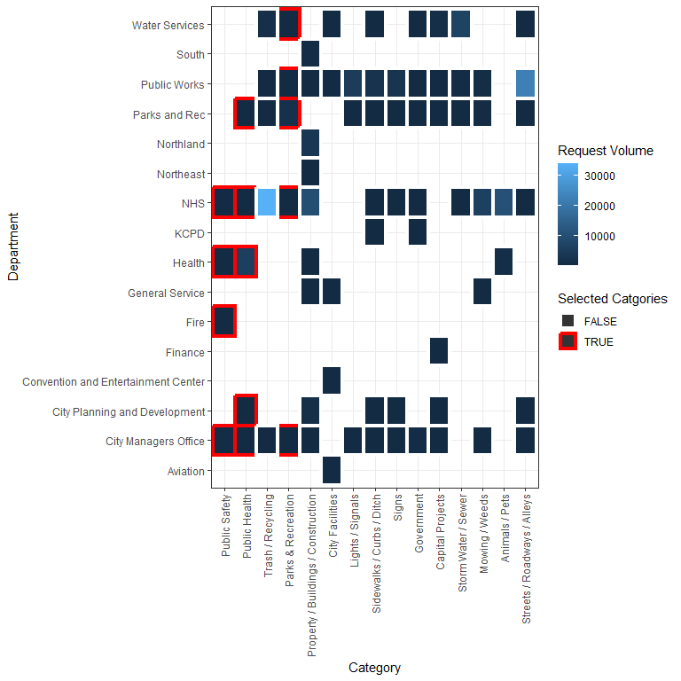

Did COVID-19 Induce A Strenuous Effect on the 311 Non-Emergency Services
System?
================

**Abstract**

In this paper we examine whether COVID-19 imposed a crowd out effect on
the 311 non-emergency services using data from Kansas City, Missouri
during the early stage of the pandemic. Using description text data, we
identify covid-related requests and use them as a proxy for the strains
put on the 311 systems by the health crisis. We find robust evidence
through our difference in difference approach that zip code with an
additional covid-related request would experience half an hour delay the
response time for non-covid related requests. In addition, the strains
on the 311 system mainly affected three categories: “Mowing / Weeds”,
“Trash / Recycling”, and “Animals & Pets”.

Keywords: crisis response, 311, crowd out effect, COVID-19, text mining

### Aggregate Trends

Call Volumes

<!-- -->

Call Volumes by Request Types

<!-- -->

<!-- -->

### Zip Code Variation

    ## `summarise()` has grouped output by 'CREATEYR', 'CATEGORY'. You can override
    ## using the `.groups` argument.
    ## Using daytoclose as value column: use value.var to override.
    ## `summarise()` has grouped output by 'CREATEYR', 'CATEGORY'. You can override
    ## using the `.groups` argument.
    ## Using n as value column: use value.var to override.
    ## Joining, by = c("CATEGORY", "ZIP")
    ## Joining, by = "ZIP"
    ## Joining, by = "ZIP"

    ## Coordinate system already present. Adding new coordinate system, which will
    ## replace the existing one.

<!-- -->

    ## `summarise()` has grouped output by 'CREATEYR'. You can override using the
    ## `.groups` argument.
    ## Using daytoclose as value column: use value.var to override.
    ## Joining, by = "ZIP"

    ## Warning: Using `size` aesthetic for lines was deprecated in ggplot2 3.4.0.
    ## ℹ Please use `linewidth` instead.

    ## `geom_smooth()` using formula = 'y ~ x'

    ## Warning: Removed 2 rows containing non-finite values (`stat_smooth()`).

    ## Warning: The following aesthetics were dropped during statistical transformation: size,
    ## colour
    ## ℹ This can happen when ggplot fails to infer the correct grouping structure in
    ##   the data.
    ## ℹ Did you forget to specify a `group` aesthetic or to convert a numerical
    ##   variable into a factor?

    ## Warning: Removed 2 rows containing missing values (`geom_point()`).

<!-- -->

    ## `summarise()` has grouped output by 'CREATEYR'. You can override using the
    ## `.groups` argument.
    ## Using daytoclose as value column: use value.var to override.
    ## Joining, by = "ZIP"

    ## 
    ## Call:
    ## lm(formula = daytoclose_diff ~ n_allcovid, data = dat %>% filter(CREATEMO %in% 
    ##     3:8) %>% group_by(CREATEYR, ZIP) %>% summarize(daytoclose = mean(DAYTOCLOSE, 
    ##     na.rm = T)) %>% dcast(ZIP ~ CREATEYR) %>% mutate(daytoclose_diff = `2020` - 
    ##     `2019`) %>% rename(daytoclose_2020 = `2020`, daytoclose_2019 = `2019`) %>% 
    ##     left_join(zip_covid_311))
    ## 
    ## Residuals:
    ##     Min      1Q  Median      3Q     Max 
    ## -38.026  -5.469   1.247   4.698  30.599 
    ## 
    ## Coefficients:
    ##             Estimate Std. Error t value Pr(>|t|)   
    ## (Intercept) -7.95615    2.26981  -3.505  0.00101 **
    ## n_allcovid   0.06051    0.03231   1.873  0.06734 . 
    ## ---
    ## Signif. codes:  0 '***' 0.001 '**' 0.01 '*' 0.05 '.' 0.1 ' ' 1
    ## 
    ## Residual standard error: 10.89 on 47 degrees of freedom
    ##   (2 observations deleted due to missingness)
    ## Multiple R-squared:  0.06943,    Adjusted R-squared:  0.04963 
    ## F-statistic: 3.507 on 1 and 47 DF,  p-value: 0.06734

### Pretrends

    ## Joining, by = "ZIP"
    ## `summarise()` has grouped output by 'group'. You can override using the
    ## `.groups` argument.

<!-- -->

### Delay in response time for non-covid related requests

    ## `geom_smooth()` using formula = 'y ~ x'

    ## Warning: Removed 67 rows containing non-finite values (`stat_smooth()`).

    ## Warning: The following aesthetics were dropped during statistical transformation: size,
    ## colour
    ## ℹ This can happen when ggplot fails to infer the correct grouping structure in
    ##   the data.
    ## ℹ Did you forget to specify a `group` aesthetic or to convert a numerical
    ##   variable into a factor?
    ## The following aesthetics were dropped during statistical transformation: size,
    ## colour
    ## ℹ This can happen when ggplot fails to infer the correct grouping structure in
    ##   the data.
    ## ℹ Did you forget to specify a `group` aesthetic or to convert a numerical
    ##   variable into a factor?
    ## The following aesthetics were dropped during statistical transformation: size,
    ## colour
    ## ℹ This can happen when ggplot fails to infer the correct grouping structure in
    ##   the data.
    ## ℹ Did you forget to specify a `group` aesthetic or to convert a numerical
    ##   variable into a factor?
    ## The following aesthetics were dropped during statistical transformation: size,
    ## colour
    ## ℹ This can happen when ggplot fails to infer the correct grouping structure in
    ##   the data.
    ## ℹ Did you forget to specify a `group` aesthetic or to convert a numerical
    ##   variable into a factor?
    ## The following aesthetics were dropped during statistical transformation: size,
    ## colour
    ## ℹ This can happen when ggplot fails to infer the correct grouping structure in
    ##   the data.
    ## ℹ Did you forget to specify a `group` aesthetic or to convert a numerical
    ##   variable into a factor?
    ## The following aesthetics were dropped during statistical transformation: size,
    ## colour
    ## ℹ This can happen when ggplot fails to infer the correct grouping structure in
    ##   the data.
    ## ℹ Did you forget to specify a `group` aesthetic or to convert a numerical
    ##   variable into a factor?
    ## The following aesthetics were dropped during statistical transformation: size,
    ## colour
    ## ℹ This can happen when ggplot fails to infer the correct grouping structure in
    ##   the data.
    ## ℹ Did you forget to specify a `group` aesthetic or to convert a numerical
    ##   variable into a factor?
    ## The following aesthetics were dropped during statistical transformation: size,
    ## colour
    ## ℹ This can happen when ggplot fails to infer the correct grouping structure in
    ##   the data.
    ## ℹ Did you forget to specify a `group` aesthetic or to convert a numerical
    ##   variable into a factor?
    ## The following aesthetics were dropped during statistical transformation: size,
    ## colour
    ## ℹ This can happen when ggplot fails to infer the correct grouping structure in
    ##   the data.
    ## ℹ Did you forget to specify a `group` aesthetic or to convert a numerical
    ##   variable into a factor?
    ## The following aesthetics were dropped during statistical transformation: size,
    ## colour
    ## ℹ This can happen when ggplot fails to infer the correct grouping structure in
    ##   the data.
    ## ℹ Did you forget to specify a `group` aesthetic or to convert a numerical
    ##   variable into a factor?
    ## The following aesthetics were dropped during statistical transformation: size,
    ## colour
    ## ℹ This can happen when ggplot fails to infer the correct grouping structure in
    ##   the data.
    ## ℹ Did you forget to specify a `group` aesthetic or to convert a numerical
    ##   variable into a factor?
    ## The following aesthetics were dropped during statistical transformation: size,
    ## colour
    ## ℹ This can happen when ggplot fails to infer the correct grouping structure in
    ##   the data.
    ## ℹ Did you forget to specify a `group` aesthetic or to convert a numerical
    ##   variable into a factor?
    ## The following aesthetics were dropped during statistical transformation: size,
    ## colour
    ## ℹ This can happen when ggplot fails to infer the correct grouping structure in
    ##   the data.
    ## ℹ Did you forget to specify a `group` aesthetic or to convert a numerical
    ##   variable into a factor?
    ## The following aesthetics were dropped during statistical transformation: size,
    ## colour
    ## ℹ This can happen when ggplot fails to infer the correct grouping structure in
    ##   the data.
    ## ℹ Did you forget to specify a `group` aesthetic or to convert a numerical
    ##   variable into a factor?
    ## The following aesthetics were dropped during statistical transformation: size,
    ## colour
    ## ℹ This can happen when ggplot fails to infer the correct grouping structure in
    ##   the data.
    ## ℹ Did you forget to specify a `group` aesthetic or to convert a numerical
    ##   variable into a factor?

    ## Warning: Removed 67 rows containing missing values (`geom_point()`).

<!-- -->

### Regression Output

    ## Joining, by = "ZIP"
    ## Joining, by = "ZIP"

    ## 
    ## =====================================================================
    ##                            OLS           FE period-rate  FE date-rate
    ## ---------------------------------------------------------------------
    ## DiD effect                     -0.1749       -0.1674         -0.2834 
    ##                                (0.1472)      (0.1468)        (0.1457)
    ## ---------------------------------------------------------------------
    ## Num. obs.                  170259        170259          170259      
    ## Num. groups: rate                            49              49      
    ## Num. groups: after                            2                      
    ## Num. groups: factor(date)                                    18      
    ## =====================================================================
    ## *** p < 0.001; ** p < 0.01; * p < 0.05

    ## 
    ## ===================================================================
    ##                            OLS         FE period-rate  FE date-rate
    ## -------------------------------------------------------------------
    ## DiD effect                   -0.0526     -0.0448         -0.0852   
    ##                              (0.4476)    (0.4506)        (0.4405)  
    ## -------------------------------------------------------------------
    ## Num. obs.                  4804        4804            4804        
    ## Num. groups: rate                        44              44        
    ## Num. groups: after                        2                        
    ## Num. groups: factor(date)                                18        
    ## ===================================================================
    ## *** p < 0.001; ** p < 0.01; * p < 0.05

    ## 
    ## ==================================================================
    ##                            OLS        FE period-rate  FE date-rate
    ## ------------------------------------------------------------------
    ## DiD effect                   0.4422     0.9210          1.0199    
    ##                             (0.9619)   (1.0150)        (0.9913)   
    ## ------------------------------------------------------------------
    ## Num. obs.                  853        853             853         
    ## Num. groups: rate                      41              41         
    ## Num. groups: after                      2                         
    ## Num. groups: factor(date)                              18         
    ## ==================================================================
    ## *** p < 0.001; ** p < 0.01; * p < 0.05

    ## 
    ## ======================================================================
    ##                            OLS           FE period-rate  FE date-rate 
    ## ----------------------------------------------------------------------
    ## DiD effect                    3.3369 **     3.3516 **       4.1238 ***
    ##                              (1.1511)      (1.1606)        (1.1095)   
    ## ----------------------------------------------------------------------
    ## Num. obs.                  2097          2097            2097         
    ## Num. groups: rate                          38              38         
    ## Num. groups: after                          2                         
    ## Num. groups: factor(date)                                  18         
    ## ======================================================================
    ## *** p < 0.001; ** p < 0.01; * p < 0.05

    ## 
    ## =========================================================================
    ##                            OLS             FE period-rate  FE date-rate  
    ## -------------------------------------------------------------------------
    ## DiD effect                      0.0159 **       0.0185 **       0.0165 **
    ##                                (0.0058)        (0.0058)        (0.0057)  
    ## -------------------------------------------------------------------------
    ## Num. obs.                  170260          170260          170260        
    ## Num. groups: n_allcovid                        41              41        
    ## Num. groups: after                              2                        
    ## Num. groups: factor(date)                                      18        
    ## =========================================================================
    ## *** p < 0.001; ** p < 0.01; * p < 0.05

    ## 
    ## ===================================================================
    ##                            OLS         FE period-rate  FE date-rate
    ## -------------------------------------------------------------------
    ## DiD effect                    0.0027      0.0030          0.0000   
    ##                              (0.0175)    (0.0176)        (0.0172)  
    ## -------------------------------------------------------------------
    ## Num. obs.                  4804        4804            4804        
    ## Num. groups: n_allcovid                  41              41        
    ## Num. groups: after                        2                        
    ## Num. groups: factor(date)                                18        
    ## ===================================================================
    ## *** p < 0.001; ** p < 0.01; * p < 0.05

    ## 
    ## ==================================================================
    ##                            OLS        FE period-rate  FE date-rate
    ## ------------------------------------------------------------------
    ## DiD effect                  -0.0191    -0.0324         -0.0285    
    ##                             (0.0520)   (0.0543)        (0.0532)   
    ## ------------------------------------------------------------------
    ## Num. obs.                  853        853             853         
    ## Num. groups: n_allcovid                39              39         
    ## Num. groups: after                      2                         
    ## Num. groups: factor(date)                              18         
    ## ==================================================================
    ## *** p < 0.001; ** p < 0.01; * p < 0.05

    ## 
    ## ===================================================================
    ##                            OLS         FE period-rate  FE date-rate
    ## -------------------------------------------------------------------
    ## DiD effect                   -0.0257     -0.0328         -0.0344   
    ##                              (0.0438)    (0.0433)        (0.0415)  
    ## -------------------------------------------------------------------
    ## Num. obs.                  2097        2097            2097        
    ## Num. groups: n_allcovid                  36              36        
    ## Num. groups: after                        2                        
    ## Num. groups: factor(date)                                18        
    ## ===================================================================
    ## *** p < 0.001; ** p < 0.01; * p < 0.05

    ## `summarise()` has grouped output by 'date', 'ZIP'. You can override using the
    ## `.groups` argument.
    ## Joining, by = "ZIP"
    ## Joining, by = "ZIP"

    ## 
    ## ==================================================================
    ##                            OLS        FE period-rate  FE date-rate
    ## ------------------------------------------------------------------
    ## DiD effect                  -0.1976    -0.1724         -0.2225    
    ##                             (0.4923)   (0.4608)        (0.4047)   
    ## ------------------------------------------------------------------
    ## Num. obs.                  873        873             873         
    ## Num. groups: rate                      49              49         
    ## Num. groups: after                      2                         
    ## Num. groups: factor(date)                              18         
    ## ==================================================================
    ## *** p < 0.001; ** p < 0.01; * p < 0.05

    ## `summarise()` has grouped output by 'date', 'ZIP'. You can override using the
    ## `.groups` argument.
    ## Joining, by = "ZIP"
    ## Joining, by = "ZIP"

    ## 
    ## ==================================================================
    ##                            OLS        FE period-rate  FE date-rate
    ## ------------------------------------------------------------------
    ## DiD effect                   0.8055     0.8299          0.7601    
    ##                             (0.5907)   (0.5915)        (0.5454)   
    ## ------------------------------------------------------------------
    ## Num. obs.                  664        664             664         
    ## Num. groups: rate                      44              44         
    ## Num. groups: after                      2                         
    ## Num. groups: factor(date)                              18         
    ## ==================================================================
    ## *** p < 0.001; ** p < 0.01; * p < 0.05

    ## `summarise()` has grouped output by 'date', 'ZIP'. You can override using the
    ## `.groups` argument.
    ## Joining, by = "ZIP"
    ## Joining, by = "ZIP"

    ## 
    ## ==================================================================
    ##                            OLS        FE period-rate  FE date-rate
    ## ------------------------------------------------------------------
    ## DiD effect                   0.7901     0.7898          1.0353    
    ##                             (1.1737)   (1.1835)        (1.1661)   
    ## ------------------------------------------------------------------
    ## Num. obs.                  343        343             343         
    ## Num. groups: rate                      41              41         
    ## Num. groups: after                      2                         
    ## Num. groups: factor(date)                              18         
    ## ==================================================================
    ## *** p < 0.001; ** p < 0.01; * p < 0.05

    ## `summarise()` has grouped output by 'date', 'ZIP'. You can override using the
    ## `.groups` argument.
    ## Joining, by = "ZIP"
    ## Joining, by = "ZIP"

    ## 
    ## ==================================================================
    ##                            OLS        FE period-rate  FE date-rate
    ## ------------------------------------------------------------------
    ## DiD effect                   2.0553     1.9024          2.5739    
    ##                             (1.5904)   (1.6129)        (1.4718)   
    ## ------------------------------------------------------------------
    ## Num. obs.                  487        487             487         
    ## Num. groups: rate                      38              38         
    ## Num. groups: after                      2                         
    ## Num. groups: factor(date)                              18         
    ## ==================================================================
    ## *** p < 0.001; ** p < 0.01; * p < 0.05

    ## `summarise()` has grouped output by 'date', 'ZIP'. You can override using the
    ## `.groups` argument.
    ## Joining, by = "ZIP"
    ## Joining, by = "ZIP"

    ## 
    ## ==================================================================
    ##                            OLS        FE period-rate  FE date-rate
    ## ------------------------------------------------------------------
    ## DiD effect                   0.0423     0.0424          0.0400    
    ##                             (0.0248)   (0.0239)        (0.0213)   
    ## ------------------------------------------------------------------
    ## Num. obs.                  874        874             874         
    ## Num. groups: n_allcovid                41              41         
    ## Num. groups: after                      2                         
    ## Num. groups: factor(date)                              18         
    ## ==================================================================
    ## *** p < 0.001; ** p < 0.01; * p < 0.05

    ## `summarise()` has grouped output by 'date', 'ZIP'. You can override using the
    ## `.groups` argument.
    ## Joining, by = "ZIP"
    ## Joining, by = "ZIP"

    ## 
    ## ==================================================================
    ##                            OLS        FE period-rate  FE date-rate
    ## ------------------------------------------------------------------
    ## DiD effect                  -0.0320    -0.0299         -0.0275    
    ##                             (0.0297)   (0.0300)        (0.0278)   
    ## ------------------------------------------------------------------
    ## Num. obs.                  664        664             664         
    ## Num. groups: n_allcovid                41              41         
    ## Num. groups: after                      2                         
    ## Num. groups: factor(date)                              18         
    ## ==================================================================
    ## *** p < 0.001; ** p < 0.01; * p < 0.05

    ## `summarise()` has grouped output by 'date', 'ZIP'. You can override using the
    ## `.groups` argument.
    ## Joining, by = "ZIP"
    ## Joining, by = "ZIP"

    ## 
    ## ==================================================================
    ##                            OLS        FE period-rate  FE date-rate
    ## ------------------------------------------------------------------
    ## DiD effect                  -0.0613    -0.0445         -0.0483    
    ##                             (0.0602)   (0.0607)        (0.0598)   
    ## ------------------------------------------------------------------
    ## Num. obs.                  343        343             343         
    ## Num. groups: n_allcovid                39              39         
    ## Num. groups: after                      2                         
    ## Num. groups: factor(date)                              18         
    ## ==================================================================
    ## *** p < 0.001; ** p < 0.01; * p < 0.05

    ## `summarise()` has grouped output by 'date', 'ZIP'. You can override using the
    ## `.groups` argument.
    ## Joining, by = "ZIP"
    ## Joining, by = "ZIP"

    ## 
    ## ==================================================================
    ##                            OLS        FE period-rate  FE date-rate
    ## ------------------------------------------------------------------
    ## DiD effect                  -0.0709    -0.0772         -0.0730    
    ##                             (0.0700)   (0.0686)        (0.0626)   
    ## ------------------------------------------------------------------
    ## Num. obs.                  487        487             487         
    ## Num. groups: n_allcovid                36              36         
    ## Num. groups: after                      2                         
    ## Num. groups: factor(date)                              18         
    ## ==================================================================
    ## *** p < 0.001; ** p < 0.01; * p < 0.05

### Discussion

Categories vs Departments

    ## Joining, by = "CATEGORY"

<!-- -->

911 trends

<!-- -->

<!-- -->
