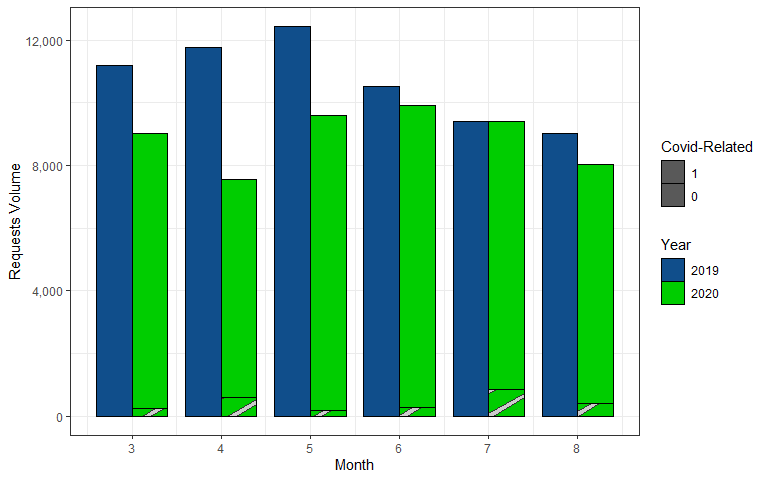

Did COVID-19 Induce A Strenuous Effect on the 311 Non-Emergency Services
System?
================

``` r
#load library
library(dplyr)
library(reshape2)
library(openxlsx)
library(car)
library(ggplot2)
library(hrbrthemes)
library(viridis)
library(ggpattern)

#load 311 data 
load("kcmo2019_2020.rdata")

#load 911 data
dat911 = read.csv("kcmo 911 volume - data.csv")
```

``` r
# create year+month var
dat$date = dat$CREATEYR*100 +dat$CREATEMO

dat$date = as.Date(as.character(dat$date*100+1),"%Y%m%d")

# create covid related calls 
dat = dat %>%
  mutate(
    
    covid = as.numeric(grepl("covid",tolower(description))|
                         grepl("corona",tolower(description))|
                         grepl("pandemic",tolower(description))|
                         grepl("virus",tolower(description))|
                         grepl("positive",tolower(description))
    ),
    
    mask = as.numeric(grepl("mask",tolower(description))|
                        grepl("face cover",tolower(description))|
                        grepl("ppe ",tolower(description))|
                        grepl("coverings",tolower(description))
    ),
    
    sdistance = as.numeric(grepl("social",tolower(description))|
                             grepl("distanc",tolower(description))|
                             grepl("6 feet",tolower(description))|
                             grepl("quarantine",tolower(description))|
                             grepl("stay at home",tolower(description))|
                             grepl("gathering",tolower(description))
    ),
    
    essential = as.numeric(grepl("essential",tolower(description))|
                             grepl("still open",tolower(description))|
                             grepl("open for business",tolower(description))|
                             grepl("open and operating",tolower(description))|
                             grepl("still operating",tolower(description))
    ), 
    
    allcovid = as.numeric((covid==1|mask==1|sdistance==1|essential==1) & season == "COVID-warm")
  )
```

Aggregate Trends

Call Volumes

``` r
dat %>% 
  group_by(date,CREATEYR,CREATEMO,allcovid) %>%
  count() %>% 
  filter(CREATEMO %in% 3:8) %>%
  mutate(CREATEYR = as.factor(CREATEYR),allcovid = as.factor(allcovid) )%>%
  ggplot(aes(x = CREATEMO, y = n,  group = CREATEYR, fill = CREATEYR))+
  geom_col_pattern(aes(pattern = reorder(allcovid,n)),position = position_dodge(),
                   col="black",width = 0.8)+
  scale_fill_manual(values = c("dodgerblue4","green3"))+
  scale_pattern_manual(values=c("stripe","none"))+
  scale_x_continuous(breaks = 3:8)+
  scale_y_continuous(labels =scales::comma)+
  labs(y = "Requests Volume",
       x = "Month",
       fill = "Year",
       pattern = "Covid-Related"
       )+
  theme_bw()
```

<!-- -->

Call Volumes by Request Types

``` r
# changes in request volume after covid by categories 
diff = dat %>% 
  filter(CATEGORY != "Data Not Available") %>%
  filter(CREATEMO %in% 3:8) %>%
  group_by(CREATEYR,CATEGORY) %>%
  count() %>% 
  dcast(CATEGORY~CREATEYR) %>% 
  mutate(diff = `2020`-`2019`,
         diff_pchg = `2020`/`2019` )

# plot request volume by categories
dat %>% 
  filter(CATEGORY != "Data Not Available") %>%
  filter(CREATEMO %in% 3:8) %>%
  group_by(CREATEYR,allcovid,CATEGORY) %>%
  count() %>% 
  left_join(diff)%>%
  mutate(CREATEYR = as.factor(CREATEYR),allcovid = as.factor(allcovid) )%>%
  ggplot(aes(x = CREATEYR, y = n,  group = reorder(CREATEYR,n), fill = CREATEYR))+
  geom_col_pattern(aes(pattern = reorder(allcovid,n)),#position = position_dodge(),
                   col="black",width = 0.8)+
  facet_wrap(~reorder(CATEGORY,-diff_pchg), scale = "free_y", ncol = 5)+
  scale_fill_manual(values = c("dodgerblue4","green3"))+
  scale_pattern_manual(values=c("stripe","none"))+
  scale_y_continuous(labels =scales::comma)+
  labs(x = "Requests Volume",
       y = "Category",
       fill = "Year",
       pattern = "Covid-Related"
       )+
  theme_bw()
```

<!-- -->

``` r
# plot response time by categories
dat %>% 
  filter(CATEGORY != "Data Not Available") %>%
  filter(CREATEMO %in% 3:8) %>%
  filter(allcovid==0) %>%
  left_join(diff)%>%
  mutate(CREATEYR = as.factor(CREATEYR))%>%
  ggplot(aes(x = CREATEYR, y = DAYTOCLOSE, fill = CREATEYR))+
  geom_boxplot(outlier.shape = NA)+
  facet_wrap(~reorder(CATEGORY,-diff_pchg), scale = "free_y", ncol = 5)+
  scale_fill_manual(values = c("dodgerblue4","green3"))+
  
  labs(x = "Reponse Time",
       y = "Category",
       fill = "Year",
       pattern = "Covid-Related"
       )+
  theme_bw()
```

<!-- -->

Discussion

Categories vs Departments

``` r
dat %>%
  filter(CATEGORY != "Data Not Available") %>%
  filter(CREATEMO %in% 3:8) %>%
  group_by(CATEGORY, DEPT) %>%
  count() %>%
  left_join(diff)%>%
  mutate(selected = CATEGORY %in% c("Public Health","Public Safety","Parks & Recreation"))%>%
  ggplot(aes(x = reorder(CATEGORY,-diff_pchg), y = DEPT, fill = n, col = selected))+
  geom_tile(lwd=1.5)+
  scale_x_discrete(guide = guide_axis(angle = 90))+
  scale_color_manual(values=c("white","red"))+
  labs(
    y = "Department",
    x = "Category",
    fill = "Request Volume",
    col = "Selected Catgories"
  )+
  theme_bw()
```

    ## Joining, by = "CATEGORY"

<!-- -->

911 trends

``` r
dat911 %>% 
  filter(month %in% 3:8) %>%
  mutate(year = as.factor(year)) %>%
  select(year, month, 
         kcmo_fire_vol,kcmo_fire_vol_911,kcmo_fire_vol_nonemergency,
         kcmo_pd_vol,kcmo_pd_vol_911,kcmo_pd_vol_nonemergency) %>%
  melt(id.vars=c("year","month")) %>%
  ggplot(aes(x = year, y = value, group = year, fill = year)) + 
  geom_boxplot(show.legend=FALSE)+
  facet_wrap(~variable,scale="free_y")+
  scale_fill_manual(values = c("dodgerblue4","green3"))+
  #scale_x_continuous(breaks = 3:8)+
  scale_y_continuous(labels =scales::comma)+
  labs(y = "911 Volume",
       x = "Month",
       fill = "Year"
       )+
  theme_bw()
```

<!-- -->

``` r
dat911 %>% 
  filter(month %in% 3:8) %>%
  mutate(year = as.factor(year)) %>%
  select(year, month, 
         kcmo_fire_pct_answered_15s,kcmo_fire_pct_answered_20s,kcmo_fire_pct_answered_40s,
         kcmo_pd_pct_answered_15s,kcmo_pd_pct_answered_20s,kcmo_pd_pct_answered_40s) %>%
  melt(id.vars=c("year","month")) %>%
  ggplot(aes(x = year, y = value, group = year, fill = year)) + 
  geom_boxplot(show.legend=FALSE)+
  facet_wrap(~variable,scale="free_y")+
  scale_fill_manual(values = c("dodgerblue4","green3"))+
  labs(y = "911 Ringtime Range",
       x = "",
       fill = "Year"
       )+
  theme_bw()
```

<!-- -->
