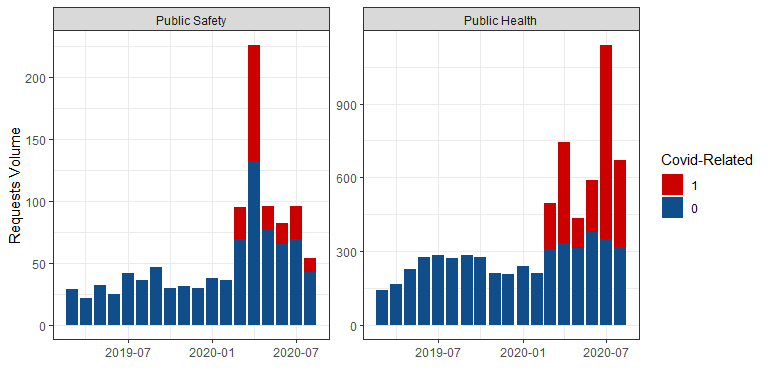
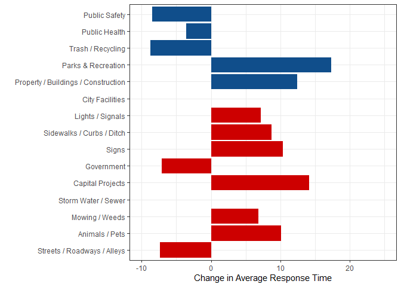
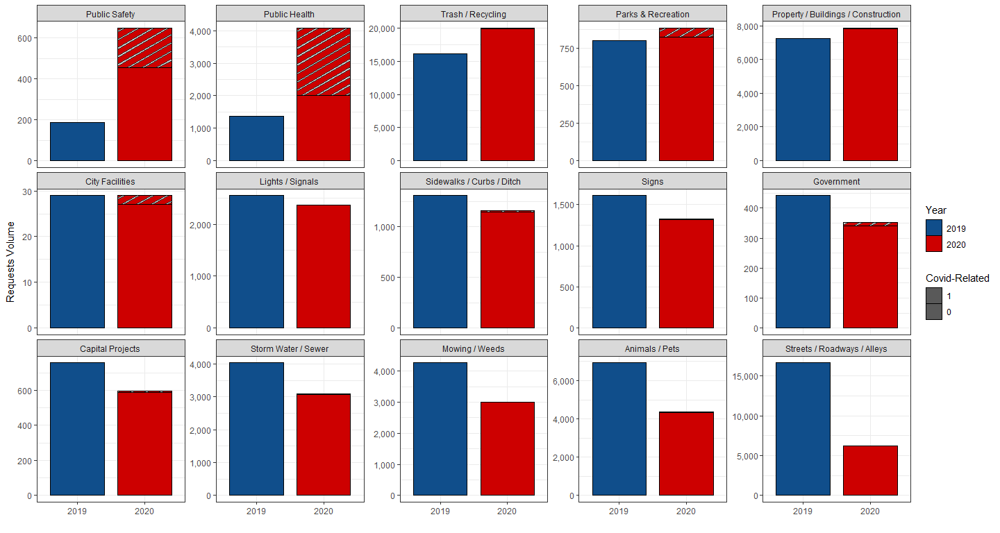
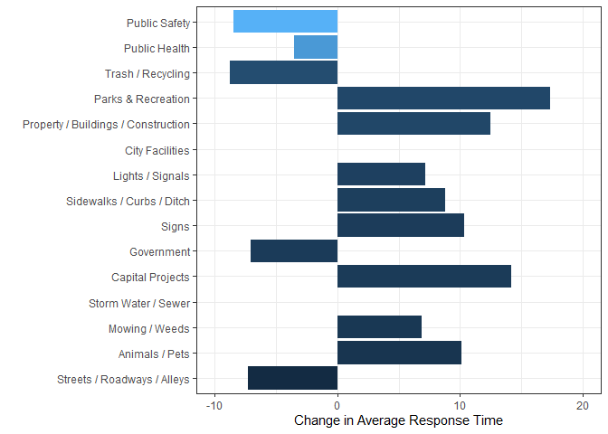
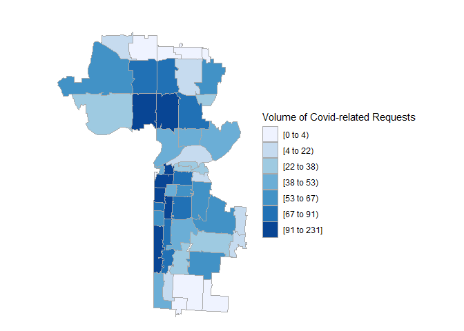
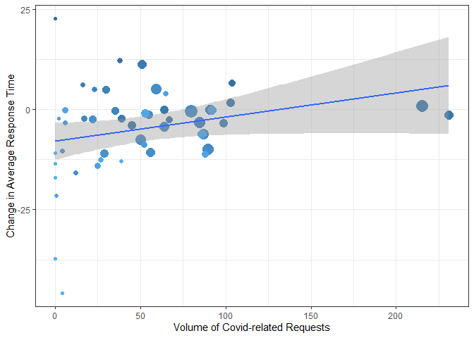
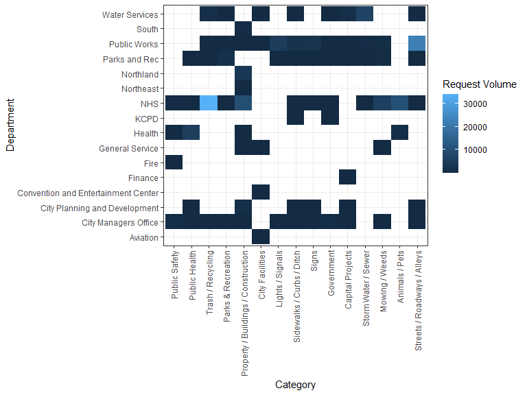

Did COVID-19 Induce A Strenuous Effect on the 311 Non-Emergency Services
System?
================

``` r
#load library
library(dplyr)
library(reshape2)
library(openxlsx)
library(car)
library(ggplot2)
library(hrbrthemes)
library(viridis)
library(ggpattern)
library(plm)
library(haven)
library(texreg)
library(lfe)
#install.packages("devtools")
#library(devtools)
#install_github('arilamstein/choroplethrZip@v1.3.0')
library(choroplethrZip)

#load 311 data 
load("kcmo2019_2020.rdata")

#load 911 data
dat911 = read.csv("kcmo 911 volume - data.csv")

#All Employees: Government: Local Government in Missouri (SMS29000009093000001)
datgov = read.csv("SMU29281409093000001SA.csv")
names(datgov) = c("datebls","empgov")
datgov$year = as.numeric(substr(datgov$datebls,1,4))
datgov$month = as.numeric(substr(datgov$datebls,6,7))
 
#covid cases by zipcode as of january 15, 2022
zip_covid = read.csv("COVID-19_Data_by_ZIP_Code.csv") 
zip_covid = zip_covid %>% dplyr::select(ZipCode,Cases,Total.Residents.Tested) %>% mutate(ZIP = ZipCode,rate = Cases/Total.Residents.Tested ) %>% dplyr::select(ZIP, rate)
```

``` r
# create year+month var
dat$date = dat$CREATEYR*100 +dat$CREATEMO

dat$date = as.Date(as.character(dat$date*100+1),"%Y%m%d")

# incomplete requests are imputed with 180 days (close date doen't exist)
#dat$DAYTOCLOSE[dat$DAYTOCLOSE==180] = NA

# create covid related calls 
dat = dat %>%
  mutate(
    
    covid = as.numeric(grepl("covid",tolower(description))|
                         grepl("corona",tolower(description))|
                         grepl("pandemic",tolower(description))|
                         grepl("virus",tolower(description))|
                         grepl("positive",tolower(description))
    ),
    
    mask = as.numeric(grepl("mask",tolower(description))|
                        grepl("face cover",tolower(description))|
                        grepl("ppe ",tolower(description))|
                        grepl("coverings",tolower(description))
    ),
    
    sdistance = as.numeric(grepl("social",tolower(description))|
                             grepl("distanc",tolower(description))|
                             grepl("6 feet",tolower(description))|
                             grepl("quarantine",tolower(description))|
                             grepl("stay at home",tolower(description))|
                             grepl("gathering",tolower(description))
    ),
    
    essential = as.numeric(grepl("essential",tolower(description))|
                             grepl("still open",tolower(description))|
                             grepl("open for business",tolower(description))|
                             grepl("open and operating",tolower(description))|
                             grepl("still operating",tolower(description))
    ), 
    
    allcovid = as.numeric((covid==1|mask==1|sdistance==1|essential==1) & season == "COVID-warm")
  )
```

supporting dataset

``` r
# changes in request volume after covid by categories 
diff = dat %>% 
  filter(CATEGORY != "Data Not Available") %>%
  filter(CREATEMO %in% 3:8) %>%
  group_by(CREATEYR,CATEGORY) %>%
  count() %>% 
  dcast(CATEGORY~CREATEYR) %>% 
  mutate(diff = `2020`-`2019`,
         diff_pchg = `2020`/`2019` )
```

    ## Using n as value column: use value.var to override.

summary statistics

``` r
#summary stats
```

Despite the influx of covid-related calls, response time for public
health and public safety are actually lower than the previous year

``` r
# plot request volume by categories
dat %>% 
  filter(CATEGORY != "Data Not Available") %>%
  filter(CATEGORY %in% c("Public Safety","Public Health")) %>%
  #filter(CREATEMO %in% 3:8) %>%
  group_by(CREATEYR,date,allcovid,CATEGORY) %>%
  count() %>% 
  left_join(diff)%>%
  mutate(CREATEYR = as.factor(CREATEYR),allcovid = as.factor(allcovid) )%>%
  ggplot(aes(x = date, y = n, fill = reorder(allcovid,-n)))+
  geom_col()+
  facet_wrap(~reorder(CATEGORY,-diff_pchg), scale = "free_y", ncol = 5)+
  scale_fill_manual(values = c("red3","dodgerblue4"))+
  scale_pattern_manual(values=c("stripe","none"))+
  scale_y_continuous(labels =scales::comma)+
  labs(y = "Requests Volume",
       x = "",
       fill = "Covid-Related"
       )+
  theme_bw()
```

    ## Joining, by = "CATEGORY"

<!-- -->

``` r
# plot response time by categories
dat %>% 
  filter(CATEGORY != "Data Not Available") %>%
  filter(CATEGORY %in% c("Public Safety","Public Health")) %>%
  #filter(CREATEMO %in% 3:8) %>%
  group_by(CREATEYR,date,allcovid,CATEGORY) %>%
  summarize(n = mean(DAYTOCLOSE,na.rm=T)) %>% 
  left_join(diff)%>%
  mutate(CREATEYR = as.factor(CREATEYR),allcovid = as.factor(allcovid) )%>%
  ggplot(aes(x = date, y = n, fill = reorder(allcovid,-n)))+
  geom_col(position = position_dodge())+
  facet_wrap(~reorder(CATEGORY,-diff_pchg), ncol = 5)+
  scale_fill_manual(values = c("red3","dodgerblue4"))+
  scale_pattern_manual(values=c("stripe","none"))+
  scale_y_continuous(labels =scales::comma)+
  labs(y = "Average Response Time",
       x = "",
       fill = "Covid-Related"
       )+
  coord_cartesian(ylim = c(0, 50)) +
  theme_bw()
```

    ## `summarise()` has grouped output by 'CREATEYR', 'date', 'allcovid'. You can override using the `.groups` argument.

    ## Joining, by = "CATEGORY"

<!-- -->

``` r
# plot request volume by categories
dat %>% 
  filter(CATEGORY != "Data Not Available") %>%
  filter(CREATEMO %in% 3:8) %>%
  group_by(CREATEYR,allcovid,CATEGORY) %>%
  count() %>% 
  left_join(diff)%>%
  mutate(CREATEYR = as.factor(CREATEYR),allcovid = as.factor(allcovid) )%>%
  ggplot(aes(x = CREATEYR, y = n,  group = reorder(CREATEYR,n), fill = CREATEYR))+
  geom_col_pattern(aes(pattern = reorder(allcovid,n)),#position = position_dodge(),
                   col="black",width = 0.8)+
  facet_wrap(~reorder(CATEGORY,-diff_pchg), scale = "free_y", ncol = 5)+
  scale_fill_manual(values = c("dodgerblue4","red3"))+
  scale_pattern_manual(values=c("stripe","none"))+
  scale_y_continuous(labels =scales::comma)+
  labs(y = "Requests Volume",
       x = "",
       fill = "Year",
       pattern = "Covid-Related"
       )+
  theme_bw()
```

    ## Joining, by = "CATEGORY"

    ## Warning: convert_polygon_sf_to_polygon_df(): Not POLYGON or MULTIPOLYGON:
    ## c("XY", "LINESTRING", "sfg")

    ## Warning: convert_polygon_sf_to_polygon_df(): Not POLYGON or MULTIPOLYGON:
    ## c("XY", "LINESTRING", "sfg")

    ## Warning: convert_polygon_sf_to_polygon_df(): Not POLYGON or MULTIPOLYGON:
    ## c("XY", "LINESTRING", "sfg")

<!-- -->

``` r
# plot response time by categories
dat %>% 
  filter(CATEGORY != "Data Not Available") %>%
  filter(CREATEMO %in% 3:8) %>%
  filter(allcovid==0) %>%
  left_join(diff)%>%
  mutate(CREATEYR = as.factor(CREATEYR))%>%
  group_by(CREATEYR, CATEGORY,diff_pchg) %>% 
  summarize(DAYTOCLOSE = mean(DAYTOCLOSE,na.rm=T)) %>% 
  dcast(CATEGORY+diff_pchg~CREATEYR) %>% mutate(
    dtc_chg = `2020`-`2019`
  ) %>%
  ggplot(aes(x = dtc_chg, y = reorder(CATEGORY,diff_pchg), fill = (diff_pchg) ))+
  geom_col(show.legend = FALSE)+
  xlim(c(-10,20))+
  #scale_fill_manual(values = c("red3","dodgerblue4"))+
  labs(x = "Change in Average Response Time",
       y = "",
  )+
  theme_bw()
```

    ## Joining, by = "CATEGORY"

    ## `summarise()` has grouped output by 'CREATEYR', 'CATEGORY'. You can override using the `.groups` argument.

    ## Using DAYTOCLOSE as value column: use value.var to override.

    ## Warning: Removed 1 rows containing missing values (position_stack).

<!-- -->

Method

Geographical variation

``` r
# yoy change in days to close
zip_dtc = dat %>% 
  #filter(CATEGORY %in% c("Public Safety","Public Health","Parks & Recreation")) %>%
  filter(CREATEMO %in% 3:8) %>%
  group_by(CREATEYR,CATEGORY, ZIP) %>%
  summarize(daytoclose = mean(DAYTOCLOSE,na.rm=T)) %>%
  dcast(CATEGORY + ZIP ~ CREATEYR) %>% 
  mutate(daytoclose_diff = `2020`-`2019`)%>% rename(daytoclose_2020 = `2020`,daytoclose_2019=`2019`)
```

    ## `summarise()` has grouped output by 'CREATEYR', 'CATEGORY'. You can override using the `.groups` argument.

    ## Using daytoclose as value column: use value.var to override.

``` r
# yoy change in volume
zip_n = dat %>% 
  #filter(CATEGORY %in% c("Public Safety","Public Health","Parks & Recreation")) %>%
  filter(CREATEMO %in% 3:8) %>%
  group_by(CREATEYR,CATEGORY, ZIP) %>%
  summarize(n = n()) %>%
  dcast(CATEGORY + ZIP ~ CREATEYR) %>% 
  mutate(n_diff = `2020`-`2019`,
         n_pchg = (`2020` / `2019`-1)*100)  %>% rename(n_2020 = `2020`,n_2019=`2019`)
```

    ## `summarise()` has grouped output by 'CREATEYR', 'CATEGORY'. You can override using the `.groups` argument.

    ## Using n as value column: use value.var to override.

``` r
# volume of covid-related of requests
zip_covid_311 = dat %>%
  group_by(ZIP) %>% 
  summarize(n = n(), n_allcovid = sum(allcovid)) %>% na.omit()

#merge data 
zip = zip_dtc %>% left_join(zip_n) %>%
  left_join(zip_covid) %>%
  left_join(zip_covid_311)
```

    ## Joining, by = c("CATEGORY", "ZIP")

    ## Joining, by = "ZIP"
    ## Joining, by = "ZIP"

``` r
#list of zip to zoom in
zip_kcmo = unique(as.character(zip_covid_311$ZIP))

#zip code choropleth for 
zip_choropleth(zip_covid_311 %>% mutate(region = as.character(ZIP), value = n_allcovid), 
               zip_zoom = zip_kcmo,
               title      = "",
               legend     = "Volume of Covid-related Requests") + coord_map()   
```

    ## Coordinate system already present. Adding new coordinate system, which will replace the existing one.

<!-- -->

``` r
#scatterplot
dat %>% 
  #filter(CATEGORY %in% c("Public Safety","Public Health","Parks & Recreation")) %>%
  filter(CREATEMO %in% 3:8) %>%
  group_by(CREATEYR, ZIP) %>%
  summarize(daytoclose = mean(DAYTOCLOSE,na.rm=T)) %>%
  dcast(ZIP ~ CREATEYR) %>% 
  mutate(daytoclose_diff = `2020`-`2019`)%>% rename(daytoclose_2020 = `2020`,daytoclose_2019=`2019`) %>%
  left_join(zip_covid_311) %>% 
  ggplot(aes(y = daytoclose_diff, x = n_allcovid, size = n, col = ZIP))+
  geom_point()+
  geom_smooth(method=lm)+
  labs(
    y = "Change in Average Response Time",
    x = "Volume of Covid-related Requests"
  )+
  theme_bw()+
  theme(legend.position = "none")
```

    ## `summarise()` has grouped output by 'CREATEYR'. You can override using the `.groups` argument.

    ## Using daytoclose as value column: use value.var to override.

    ## Joining, by = "ZIP"

    ## `geom_smooth()` using formula 'y ~ x'

    ## Warning: Removed 2 rows containing non-finite values (stat_smooth).

    ## Warning: Removed 2 rows containing missing values (geom_point).

<!-- -->

``` r
#linear regression
summary(lm(daytoclose_diff~n_allcovid, data = dat %>% 
  #filter(CATEGORY %in% c("Public Safety","Public Health","Parks & Recreation")) %>%
  filter(CREATEMO %in% 3:8) %>%
  group_by(CREATEYR, ZIP) %>%
  summarize(daytoclose = mean(DAYTOCLOSE,na.rm=T)) %>%
  dcast(ZIP ~ CREATEYR) %>% 
  mutate(daytoclose_diff = `2020`-`2019`)%>% rename(daytoclose_2020 = `2020`,daytoclose_2019=`2019`) %>%
  left_join(zip_covid_311)
))
```

    ## `summarise()` has grouped output by 'CREATEYR'. You can override using the `.groups` argument.

    ## Using daytoclose as value column: use value.var to override.

    ## Joining, by = "ZIP"

    ## 
    ## Call:
    ## lm(formula = daytoclose_diff ~ n_allcovid, data = dat %>% filter(CREATEMO %in% 
    ##     3:8) %>% group_by(CREATEYR, ZIP) %>% summarize(daytoclose = mean(DAYTOCLOSE, 
    ##     na.rm = T)) %>% dcast(ZIP ~ CREATEYR) %>% mutate(daytoclose_diff = `2020` - 
    ##     `2019`) %>% rename(daytoclose_2020 = `2020`, daytoclose_2019 = `2019`) %>% 
    ##     left_join(zip_covid_311))
    ## 
    ## Residuals:
    ##     Min      1Q  Median      3Q     Max 
    ## -38.026  -5.469   1.247   4.698  30.599 
    ## 
    ## Coefficients:
    ##             Estimate Std. Error t value Pr(>|t|)   
    ## (Intercept) -7.95615    2.26981  -3.505  0.00101 **
    ## n_allcovid   0.06051    0.03231   1.873  0.06734 . 
    ## ---
    ## Signif. codes:  0 '***' 0.001 '**' 0.01 '*' 0.05 '.' 0.1 ' ' 1
    ## 
    ## Residual standard error: 10.89 on 47 degrees of freedom
    ##   (2 observations deleted due to missingness)
    ## Multiple R-squared:  0.06943,    Adjusted R-squared:  0.04963 
    ## F-statistic: 3.507 on 1 and 47 DF,  p-value: 0.06734

Difference in difference

state and explain model

Regression results

``` r
# create data for request level reg
dat_reg = dat %>% 
  filter(allcovid==0) %>%
  left_join(zip_covid_311) %>% 
  mutate(after = as.numeric(season == "COVID-warm"),
         did = n_allcovid*after
         ) %>%  
  left_join(dat911, by=c("CREATEMO" = "month","CREATEYR" = "year")) %>%
  left_join(datgov, by=c("CREATEMO" = "month","CREATEYR" = "year"))
```

    ## Joining, by = "ZIP"

``` r
#ols 
reg_ols = lm(data= dat_reg, DAYTOCLOSE~did + n_allcovid + after)
#fe: rate + after
reg_fe_a = (felm(data = dat_reg,DAYTOCLOSE~did|n_allcovid+after ))
#fe: rate + date(year-month)
reg_fe_b = (felm(data = dat_reg,DAYTOCLOSE~did|n_allcovid+factor(date) ))
#fe: rate + date(year-month)
reg_fe_c = (felm(data = dat_reg,DAYTOCLOSE~did|factor(NEIGH)+factor(date) ))

#combine reg 
screenreg(list(reg_ols, reg_fe_a, reg_fe_b,reg_fe_c), 
          omit.coef = "after|n_allcovid|Intercept|NEIGH", digits=4, 
          include.rsquared = FALSE, include.adjrs = FALSE, include.rmse = FALSE,
          custom.model.names = c("OLS", "FE period-zipcode", "FE date-zipcode","FE date-neighborhood"),
          custom.coef.names = "DiD effect"
          )
```

    ## 
    ## ====================================================================================================
    ##                             OLS             FE period-zipcode  FE date-zipcode  FE date-neighborhood
    ## ----------------------------------------------------------------------------------------------------
    ## DiD effect                       0.0159 **       0.0185 **          0.0165 **        0.0189 ***     
    ##                                 (0.0058)        (0.0058)           (0.0057)         (0.0056)        
    ## ----------------------------------------------------------------------------------------------------
    ## Num. obs.                   170260          170260             170260           170260              
    ## Num. groups: n_allcovid                         41                 41                               
    ## Num. groups: after                               2                                                  
    ## Num. groups: factor(date)                                          18               18              
    ## Num. groups: factor(NEIGH)                                                         241              
    ## ====================================================================================================
    ## *** p < 0.001; ** p < 0.01; * p < 0.05

``` r
#fe: rate + after
reg_fe_a = (felm(data = dat_reg,DAYTOCLOSE~did|n_allcovid+after ))
#fe: 911
reg_fe_b = (felm(data = dat_reg,DAYTOCLOSE~did+kcmo_fire_vol+kcmo_pd_vol|n_allcovid+after ))
#fe: gov employees
reg_fe_c = (felm(data = dat_reg,DAYTOCLOSE~did+empgov|n_allcovid+after ))
#fe: 911 + gov employees
reg_fe_d = (felm(data = dat_reg,DAYTOCLOSE~did+empgov+kcmo_fire_vol+kcmo_pd_vol|n_allcovid+after ))

#combine reg 
screenreg(list(reg_fe_a, reg_fe_b,reg_fe_c,reg_fe_d), 
          omit.coef = "after|n_allcovid|Intercept|NEIGH", digits=4, 
          include.rsquared = FALSE, include.adjrs = FALSE, include.rmse = FALSE,
          custom.model.names = c("(1)", "(2)","(3)","(4)"),
          custom.coef.names = c("DiD effect","911 Vol Fire Department","911 Vol Police Department","Local Government Employees")
          )
```

    ## 
    ## =============================================================================================
    ##                             (1)             (2)              (3)              (4)            
    ## ---------------------------------------------------------------------------------------------
    ## DiD effect                       0.0185 **       0.0198 ***       0.0192 ***       0.0199 ***
    ##                                 (0.0058)        (0.0058)         (0.0058)         (0.0058)   
    ## 911 Vol Fire Department                          0.0039 ***                        0.0030 ***
    ##                                                 (0.0002)                          (0.0002)   
    ## 911 Vol Police Department                       -0.0006 ***                       -0.0003 ***
    ##                                                 (0.0000)                          (0.0000)   
    ## Local Government Employees                                        1.3750 ***       0.9850 ***
    ##                                                                  (0.0816)         (0.0948)   
    ## ---------------------------------------------------------------------------------------------
    ## Num. obs.                   170260          170260           170260           170260         
    ## Num. groups: n_allcovid         41              41               41               41         
    ## Num. groups: after               2               2                2                2         
    ## =============================================================================================
    ## *** p < 0.001; ** p < 0.01; * p < 0.05

``` r
#fe: 911 + gov employees
reg_fe_01 = (felm(data = dat_reg[dat_reg$CATEGORY=="Animals / Pets",],DAYTOCLOSE~did+empgov+kcmo_fire_vol+kcmo_pd_vol|n_allcovid+after ))
reg_fe_02 = (felm(data = dat_reg[dat_reg$CATEGORY=="Capital Projects",],DAYTOCLOSE~did+empgov+kcmo_fire_vol+kcmo_pd_vol|n_allcovid+after ))
reg_fe_03 = (felm(data = dat_reg[dat_reg$CATEGORY=="City Facilities",],DAYTOCLOSE~did+empgov+kcmo_fire_vol+kcmo_pd_vol|n_allcovid+after ))
reg_fe_04 = (felm(data = dat_reg[dat_reg$CATEGORY=="Government",],DAYTOCLOSE~did+empgov+kcmo_fire_vol+kcmo_pd_vol|n_allcovid+after ))
reg_fe_05 = (felm(data = dat_reg[dat_reg$CATEGORY=="Lights / Signals",],DAYTOCLOSE~did+empgov+kcmo_fire_vol+kcmo_pd_vol|n_allcovid+after ))
reg_fe_06 = (felm(data = dat_reg[dat_reg$CATEGORY=="Mowing / Weeds",],DAYTOCLOSE~did+empgov+kcmo_fire_vol+kcmo_pd_vol|n_allcovid+after ))
reg_fe_07 = (felm(data = dat_reg[dat_reg$CATEGORY=="Parks & Recreation",],DAYTOCLOSE~did+empgov+kcmo_fire_vol+kcmo_pd_vol|n_allcovid+after ))
reg_fe_08 = (felm(data = dat_reg[dat_reg$CATEGORY=="Property / Buildings / Construction",],DAYTOCLOSE~did+empgov+kcmo_fire_vol+kcmo_pd_vol|n_allcovid+after ))
reg_fe_09 = (felm(data = dat_reg[dat_reg$CATEGORY=="Public Health",],DAYTOCLOSE~did+empgov+kcmo_fire_vol+kcmo_pd_vol|n_allcovid+after ))
reg_fe_10 = (felm(data = dat_reg[dat_reg$CATEGORY=="Public Safety",],DAYTOCLOSE~did+empgov+kcmo_fire_vol+kcmo_pd_vol|n_allcovid+after ))
reg_fe_11 = (felm(data = dat_reg[dat_reg$CATEGORY=="Sidewalks / Curbs / Ditch",],DAYTOCLOSE~did+empgov+kcmo_fire_vol+kcmo_pd_vol|n_allcovid+after ))
reg_fe_12 = (felm(data = dat_reg[dat_reg$CATEGORY=="Signs",],DAYTOCLOSE~did+empgov+kcmo_fire_vol+kcmo_pd_vol|n_allcovid+after ))
reg_fe_13 = (felm(data = dat_reg[dat_reg$CATEGORY=="Storm Water / Sewer",],DAYTOCLOSE~did+empgov+kcmo_fire_vol+kcmo_pd_vol|n_allcovid+after ))
reg_fe_14 = (felm(data = dat_reg[dat_reg$CATEGORY=="Streets / Roadways / Alleys",],DAYTOCLOSE~did+empgov+kcmo_fire_vol+kcmo_pd_vol|n_allcovid+after ))
reg_fe_15 = (felm(data = dat_reg[dat_reg$CATEGORY=="Trash / Recycling",],DAYTOCLOSE~did+empgov+kcmo_fire_vol+kcmo_pd_vol|n_allcovid+after ))

#combine reg 
screenreg(list(reg_fe_01, reg_fe_02,reg_fe_03,reg_fe_04,reg_fe_05), 
          omit.coef = "after|n_allcovid|Intercept|NEIGH", digits=4, 
          include.rsquared = FALSE, include.adjrs = FALSE, include.rmse = FALSE,
          custom.model.names = c("Animals / Pets", "Capital Projects","City Facilities","Government","Lights / Signals"),
          custom.coef.names = c("DiD effect","911 Vol Fire Department","911 Vol Police Department","Local Government Employees")
          )
```

    ## 
    ## ===========================================================================================================
    ##                             Animals / Pets  Capital Projects  City Facilities  Government  Lights / Signals
    ## -----------------------------------------------------------------------------------------------------------
    ## DiD effect                      0.0371 **      0.0337          0.1076             0.0589     -0.0188       
    ##                                (0.0117)       (0.0383)        (0.6713)           (0.0553)    (0.0116)      
    ## 911 Vol Fire Department         1.0010 ***     1.9314 **      -4.3699             0.8018      0.1685       
    ##                                (0.1567)       (0.7472)        (5.7445)           (0.6738)    (0.2106)      
    ## 911 Vol Police Department       0.0015 ***     0.0182 ***      0.0171             0.0011      0.0016 ***   
    ##                                (0.0003)       (0.0016)        (0.0128)           (0.0015)    (0.0004)      
    ## Local Government Employees     -0.0005 ***    -0.0027 ***     -0.0030            -0.0006     -0.0005 ***   
    ##                                (0.0001)       (0.0004)        (0.0029)           (0.0003)    (0.0001)      
    ## -----------------------------------------------------------------------------------------------------------
    ## Num. obs.                   16252           1812              82               1182        7586            
    ## Num. groups: n_allcovid        41             41              18                 41          41            
    ## Num. groups: after              2              2               2                  2           2            
    ## ===========================================================================================================
    ## *** p < 0.001; ** p < 0.01; * p < 0.05

``` r
#combine reg 
screenreg(list(reg_fe_06, reg_fe_07,reg_fe_08,reg_fe_09,reg_fe_10), 
          omit.coef = "after|n_allcovid|Intercept|NEIGH", digits=4, 
          include.rsquared = FALSE, include.adjrs = FALSE, include.rmse = FALSE,
          custom.model.names = c("Mowing / Weeds", "Parks & Recreation","Property / Buildings / Construction","Public Health","Public Safety"),
          custom.coef.names = c("DiD effect","911 Vol Fire Department","911 Vol Police Department","Local Government Employees")
          )
```

    ## 
    ## =================================================================================================================================
    ##                             Mowing / Weeds  Parks & Recreation  Property / Buildings / Construction  Public Health  Public Safety
    ## ---------------------------------------------------------------------------------------------------------------------------------
    ## DiD effect                     0.1056 *       -0.0365               0.0125                              0.0009       -0.0324     
    ##                               (0.0423)        (0.0427)             (0.0250)                            (0.0174)      (0.0537)    
    ## 911 Vol Fire Department        4.5563 ***      1.1339               2.5308 ***                         -0.8397 **     1.1520     
    ##                               (0.7009)        (0.6402)             (0.3367)                            (0.3056)      (0.8129)    
    ## 911 Vol Police Department      0.0044 **       0.0087 ***           0.0088 ***                          0.0021 **    -0.0053 **  
    ##                               (0.0014)        (0.0014)             (0.0008)                            (0.0007)      (0.0019)    
    ## Local Government Employees    -0.0009 **      -0.0017 ***          -0.0019 ***                         -0.0010 ***    0.0006     
    ##                               (0.0003)        (0.0003)             (0.0002)                            (0.0002)      (0.0005)    
    ## ---------------------------------------------------------------------------------------------------------------------------------
    ## Num. obs.                   8969            2097                22334                                4804           853          
    ## Num. groups: n_allcovid       41              36                   41                                  41            39          
    ## Num. groups: after             2               2                    2                                   2             2          
    ## =================================================================================================================================
    ## *** p < 0.001; ** p < 0.01; * p < 0.05

``` r
#combine reg 
screenreg(list(reg_fe_11, reg_fe_12,reg_fe_13,reg_fe_14,reg_fe_15), 
          omit.coef = "after|n_allcovid|Intercept|NEIGH", digits=4, 
          include.rsquared = FALSE, include.adjrs = FALSE, include.rmse = FALSE,
          custom.model.names = c("Sidewalks / Curbs / Ditch", "Signs","Storm Water / Sewer","Streets / Roadways / Alleys","Trash / Recycling"),
          custom.coef.names = c("DiD effect","911 Vol Fire Department","911 Vol Police Department","Local Government Employees"))
```

    ## 
    ## =========================================================================================================================================
    ##                             Sidewalks / Curbs / Ditch  Signs          Storm Water / Sewer  Streets / Roadways / Alleys  Trash / Recycling
    ## -----------------------------------------------------------------------------------------------------------------------------------------
    ## DiD effect                     0.0072                    -0.0071        -0.0012               -0.0232 *                     0.0622 ***   
    ##                               (0.0263)                   (0.0203)       (0.0185)              (0.0097)                     (0.0090)      
    ## 911 Vol Fire Department        1.1116 **                  1.6073 ***    -0.8295 *              0.6857 ***                   0.2235       
    ##                               (0.4111)                   (0.3772)       (0.3249)              (0.1772)                     (0.1473)      
    ## 911 Vol Police Department      0.0041 ***                 0.0029 ***     0.0015 *              0.0040 ***                   0.0013 ***   
    ##                               (0.0009)                   (0.0008)       (0.0007)              (0.0003)                     (0.0003)      
    ## Local Government Employees    -0.0008 ***                -0.0004 *       0.0002               -0.0004 ***                  -0.0005 ***   
    ##                               (0.0002)                   (0.0002)       (0.0002)              (0.0001)                     (0.0001)      
    ## -----------------------------------------------------------------------------------------------------------------------------------------
    ## Num. obs.                   3231                       4362           9337                 33034                        54279            
    ## Num. groups: n_allcovid       40                         41             41                    41                           41            
    ## Num. groups: after             2                          2              2                     2                            2            
    ## =========================================================================================================================================
    ## *** p < 0.001; ** p < 0.01; * p < 0.05

Departments

``` r
dat %>%
  filter(CATEGORY != "Data Not Available") %>%
  filter(CREATEMO %in% 3:8) %>%
  group_by(CATEGORY, DEPT) %>%
  count() %>%
  left_join(diff)%>%
  ggplot(aes(x = reorder(CATEGORY,-diff_pchg), y = DEPT, fill = n))+
  geom_tile(lwd=1.5)+
  scale_x_discrete(guide = guide_axis(angle = 90))+
  labs(
    y = "Department",
    x = "Category",
    fill = "Request Volume",
    col = "Selected Catgories"
  )+
  theme_bw()
```

    ## Joining, by = "CATEGORY"

<!-- -->

``` r
#fe: 911 + gov employees
reg_fe_01 = (felm(data = dat_reg[dat_reg$DEPT=="Aviation",],DAYTOCLOSE~did+empgov+kcmo_fire_vol+kcmo_pd_vol|n_allcovid+after ))
reg_fe_02 = (felm(data = dat_reg[dat_reg$DEPT=="City Managers Office",],DAYTOCLOSE~did+empgov+kcmo_fire_vol+kcmo_pd_vol|n_allcovid+after ))
reg_fe_03 = (felm(data = dat_reg[dat_reg$DEPT=="City Planning and Development",],DAYTOCLOSE~did+empgov+kcmo_fire_vol+kcmo_pd_vol|n_allcovid+after ))
#reg_fe_04 = (felm(data = dat_reg[dat_reg$DEPT=="Convention and Entertainment Center",],DAYTOCLOSE~did+empgov+kcmo_fire_vol+kcmo_pd_vol|n_allcovid+after ))
reg_fe_05 = (felm(data = dat_reg[dat_reg$DEPT=="Finance",],DAYTOCLOSE~did+empgov+kcmo_fire_vol+kcmo_pd_vol|n_allcovid+after ))
reg_fe_06 = (felm(data = dat_reg[dat_reg$DEPT=="Fire",],DAYTOCLOSE~did+empgov+kcmo_fire_vol+kcmo_pd_vol|n_allcovid+after ))
reg_fe_07 = (felm(data = dat_reg[dat_reg$DEPT=="General Service",],DAYTOCLOSE~did+empgov+kcmo_fire_vol+kcmo_pd_vol|n_allcovid+after ))
reg_fe_08 = (felm(data = dat_reg[dat_reg$DEPT=="Health",],DAYTOCLOSE~did+empgov+kcmo_fire_vol+kcmo_pd_vol|n_allcovid+after ))
#reg_fe_09 = (felm(data = dat_reg[dat_reg$DEPT=="KCPD",],DAYTOCLOSE~did+empgov+kcmo_fire_vol+kcmo_pd_vol|n_allcovid+after ))
reg_fe_10 = (felm(data = dat_reg[dat_reg$DEPT=="NHS",],DAYTOCLOSE~did+empgov+kcmo_fire_vol+kcmo_pd_vol|n_allcovid+after ))
#reg_fe_11 = (felm(data = dat_reg[dat_reg$DEPT=="Northeast",],DAYTOCLOSE~did+empgov+kcmo_fire_vol+kcmo_pd_vol|n_allcovid+after ))
reg_fe_12 = (felm(data = dat_reg[dat_reg$DEPT=="Northland",],DAYTOCLOSE~did+empgov+kcmo_fire_vol+kcmo_pd_vol|n_allcovid+after ))
reg_fe_13 = (felm(data = dat_reg[dat_reg$DEPT=="Parks and Rec",],DAYTOCLOSE~did+empgov+kcmo_fire_vol+kcmo_pd_vol|n_allcovid+after ))
reg_fe_14 = (felm(data = dat_reg[dat_reg$DEPT=="Public Works",],DAYTOCLOSE~did+empgov+kcmo_fire_vol+kcmo_pd_vol|n_allcovid+after ))
reg_fe_15 = (felm(data = dat_reg[dat_reg$DEPT=="South",],DAYTOCLOSE~did+empgov+kcmo_fire_vol+kcmo_pd_vol|n_allcovid+after ))
reg_fe_16 = (felm(data = dat_reg[dat_reg$DEPT=="Water Services",],DAYTOCLOSE~did+empgov+kcmo_fire_vol+kcmo_pd_vol|n_allcovid+after ))


#combine reg 
screenreg(list(reg_fe_01, reg_fe_02,reg_fe_03,reg_fe_05), 
          omit.coef = "after|n_allcovid|Intercept|NEIGH", digits=4, 
          include.rsquared = FALSE, include.adjrs = FALSE, include.rmse = FALSE,
          custom.model.names = c("Aviation","City Managers Office","City Planning and Development","Finance"),
          custom.coef.names = c("DiD effect","911 Vol Fire Department","911 Vol Police Department","Local Government Employees")
          )
```

    ## 
    ## =====================================================================================================
    ##                             Aviation   City Managers Office  City Planning and Development  Finance  
    ## -----------------------------------------------------------------------------------------------------
    ## DiD effect                   -0.8670     -0.0105                0.0211                        0.0760 
    ##                              (2.0705)    (0.0318)              (0.0775)                      (0.1089)
    ## 911 Vol Fire Department      -3.1367      2.5870 ***            4.0121 **                    -1.4267 
    ##                             (13.2196)    (0.5088)              (1.4540)                      (1.7708)
    ## 911 Vol Police Department    -0.0042     -0.0025 *              0.0095 **                     0.0006 
    ##                              (0.0158)    (0.0011)              (0.0031)                      (0.0037)
    ## Local Government Employees   -0.0005      0.0003               -0.0020 **                    -0.0001 
    ##                              (0.0020)    (0.0003)              (0.0007)                      (0.0008)
    ## -----------------------------------------------------------------------------------------------------
    ## Num. obs.                    13        2938                  1688                           246      
    ## Num. groups: n_allcovid       3          41                    40                            38      
    ## Num. groups: after            2           2                     2                             2      
    ## =====================================================================================================
    ## *** p < 0.001; ** p < 0.01; * p < 0.05

``` r
#combine reg 
screenreg(list(reg_fe_06, reg_fe_07,reg_fe_08,reg_fe_10), 
          omit.coef = "after|n_allcovid|Intercept|NEIGH", digits=4, 
          include.rsquared = FALSE, include.adjrs = FALSE, include.rmse = FALSE,
          custom.model.names = c("Fire","General Service","Health","NHS"),
          custom.coef.names = c("DiD effect","911 Vol Fire Department","911 Vol Police Department","Local Government Employees")
          )
```

    ## 
    ## ====================================================================================
    ##                             Fire      General Service  Health         NHS           
    ## ------------------------------------------------------------------------------------
    ## DiD effect                   0.1117   -0.2692            -0.0325         -0.0034    
    ##                             (0.2481)  (0.8760)           (0.0189)        (0.0098)   
    ## 911 Vol Fire Department     -4.2686    8.8233             0.9686 **       0.9419 ***
    ##                             (3.8690)  (6.9716)           (0.3096)        (0.1499)   
    ## 911 Vol Police Department    0.0079   -0.0071             0.0028 ***      0.0024 ***
    ##                             (0.0093)  (0.0156)           (0.0007)        (0.0003)   
    ## Local Government Employees  -0.0016    0.0009            -0.0010 ***     -0.0001    
    ##                             (0.0020)  (0.0035)           (0.0002)        (0.0001)   
    ## ------------------------------------------------------------------------------------
    ## Num. obs.                   62        65               6350           87987         
    ## Num. groups: n_allcovid     26        18                 41              41         
    ## Num. groups: after           2         2                  2               2         
    ## ====================================================================================
    ## *** p < 0.001; ** p < 0.01; * p < 0.05

``` r
#combine reg 
screenreg(list(reg_fe_12,reg_fe_13,reg_fe_14,reg_fe_15,reg_fe_16), 
          omit.coef = "after|n_allcovid|Intercept|NEIGH", digits=4, 
          include.rsquared = FALSE, include.adjrs = FALSE, include.rmse = FALSE,
          custom.model.names = c("Northland","Parks and Rec","Public Works","South","Water Services"),
          custom.coef.names = c("DiD effect","911 Vol Fire Department","911 Vol Police Department","Local Government Employees"))
```

    ## 
    ## ======================================================================================================
    ##                             Northland      Parks and Rec  Public Works    South         Water Services
    ## ------------------------------------------------------------------------------------------------------
    ## DiD effect                     0.0622        -0.0087         -0.0061       -0.0346          0.1353 ***
    ##                               (0.0518)       (0.0352)        (0.0075)      (0.0717)        (0.0150)   
    ## 911 Vol Fire Department        2.5139 ***     2.2991 ***      0.2053       -1.3342          0.1731    
    ##                               (0.3380)       (0.5423)        (0.1336)      (2.0364)        (0.3086)   
    ## 911 Vol Police Department      0.0153 ***     0.0067 ***      0.0047 ***    0.0172 ***     -0.0003    
    ##                               (0.0008)       (0.0012)        (0.0003)      (0.0044)        (0.0007)   
    ## Local Government Employees    -0.0032 ***    -0.0012 ***     -0.0008 ***   -0.0031 **       0.0006 ***
    ##                               (0.0002)       (0.0003)        (0.0001)      (0.0011)        (0.0002)   
    ## ------------------------------------------------------------------------------------------------------
    ## Num. obs.                   5952           2910           48721           511           12757         
    ## Num. groups: n_allcovid       28             40              41            13              41         
    ## Num. groups: after             2              2               2             2               2         
    ## ======================================================================================================
    ## *** p < 0.001; ** p < 0.01; * p < 0.05
